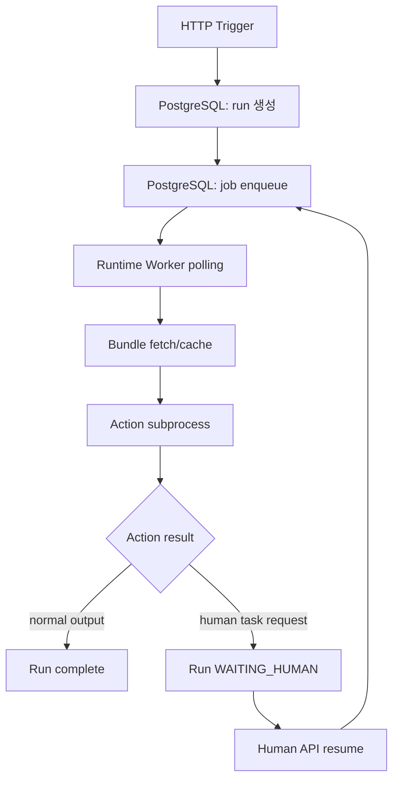
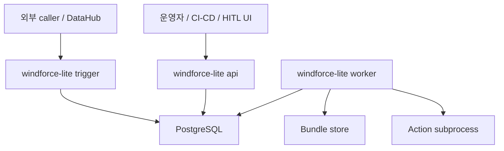
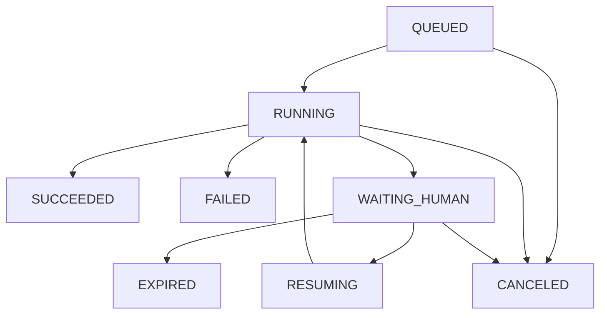

# ADR 0002: PostgreSQL 기반 runtime, job polling, HITL 실행 모델

## Status

Accepted

## Context

원 Windforce는 HTTP trigger가 job을 만들고 DB에 기록한 뒤, runtime worker가 polling하여 실행하는 구조였다. 이 구조는 trigger와 worker를 분리하고, 실행을 재시도하거나 비동기로 관찰할 수 있다는 장점이 있다.

`windforce-lite`도 이 기본 구조를 유지한다. 특히 HITL(Human-in-the-loop)을 지원하려면 단순 request-response runner나 Redis queue만으로는 부족하다. 사람이 승인하거나 값을 입력하는 동안 실행은 일시 정지되어야 하고, 이후 resume event로 다시 worker queue에 들어가야 한다.

Kubernetes 환경에 이미 PostgreSQL이 있으므로 production state backend는 PostgreSQL로 둔다. Redis는 필요하면 notify/cache 최적화 계층으로만 추가한다.

## Decision

`windforce-lite` runtime은 다음 세 계층으로 나눈다.



프로세스 역할은 HTTP trigger, backend/control plane API, runtime worker로 분리한다. 하나의 binary가 여러 mode를 제공할 수는 있지만, production에서는 서로 다른 process와 Kubernetes Service로 분리하는 것을 기본 설계로 둔다.



핵심 entity는 다음과 같다.

| Entity | 의미 | 수명 |
|---|---|---|
| `Run` | 외부 trigger 하나에 대응하는 전체 실행 인스턴스 | 완료/실패/취소/만료까지 |
| `Job` | worker가 실제로 claim해서 실행하는 단위 | 짧음, lease 기반 |
| `HumanTask` | 사람이 승인/입력해야 하는 대기 항목 | resume 또는 expire까지 |
| `Deployment` | 요청 시점에 pin된 app/action bundle 버전 | run 내부에 저장 |
| `RunEvent` | 상태 전이, resume, 실패, 재시도 감사 로그 | 보존 정책까지 |
| `Result` | 최종 output 또는 실패 envelope | TTL 또는 보존 정책 가능 |

## Storage Model

Production backend는 PostgreSQL이다. local file backend는 개발과 smoke 용도로만 둔다.

| Backend | 목적 | 판단 |
|---|---|---|
| `postgres` | production run/job/HITL state | 기본값 |
| `local` | 개발, standalone, 단일 프로세스 smoke | 운영 비권장 |
| `redis` | optional notify/cache/pub-sub | source of truth 아님 |

기본 interface는 다음 책임을 가진다.

```go
type RunStore interface {
    CreateRun(ctx context.Context, run Run) error
    GetRun(ctx context.Context, runID string) (Run, error)
    TransitionRun(ctx context.Context, runID string, from State, to State, patch Patch) error
    CompleteRun(ctx context.Context, runID string, result Result) error
    CreateHumanTask(ctx context.Context, task HumanTask) error
    CompleteHumanTask(ctx context.Context, taskID string, resume ResumeInput) error
    AppendEvent(ctx context.Context, event RunEvent) error
}

type JobStore interface {
    Enqueue(ctx context.Context, job Job) error
    Claim(ctx context.Context, workerID string, leaseTTL time.Duration) (Job, Lease, error)
    Heartbeat(ctx context.Context, lease Lease) error
    Complete(ctx context.Context, lease Lease, result JobResult) error
    Release(ctx context.Context, lease Lease, reason string) error
}
```

## PostgreSQL Schema

MVP schema:

```sql
CREATE TABLE runs (
    id TEXT PRIMARY KEY,
    adapter TEXT NOT NULL,
    app TEXT NOT NULL,
    action TEXT NOT NULL,
    state TEXT NOT NULL,
    deployment JSONB NOT NULL,
    input JSONB NOT NULL,
    output JSONB,
    error JSONB,
    task_id TEXT,
    created_at TIMESTAMPTZ NOT NULL DEFAULT now(),
    updated_at TIMESTAMPTZ NOT NULL DEFAULT now(),
    expires_at TIMESTAMPTZ
);

CREATE TABLE jobs (
    id TEXT PRIMARY KEY,
    run_id TEXT NOT NULL REFERENCES runs(id),
    state TEXT NOT NULL,
    kind TEXT NOT NULL,
    payload JSONB NOT NULL,
    priority INTEGER NOT NULL DEFAULT 100,
    attempt INTEGER NOT NULL DEFAULT 0,
    lease_owner TEXT,
    lease_expires_at TIMESTAMPTZ,
    created_at TIMESTAMPTZ NOT NULL DEFAULT now(),
    updated_at TIMESTAMPTZ NOT NULL DEFAULT now()
);

CREATE TABLE human_tasks (
    id TEXT PRIMARY KEY,
    run_id TEXT NOT NULL REFERENCES runs(id),
    state TEXT NOT NULL,
    title TEXT NOT NULL,
    description TEXT,
    schema JSONB,
    resume_input JSONB,
    token_hash TEXT,
    created_at TIMESTAMPTZ NOT NULL DEFAULT now(),
    completed_at TIMESTAMPTZ,
    expires_at TIMESTAMPTZ
);

CREATE TABLE run_events (
    id BIGSERIAL PRIMARY KEY,
    run_id TEXT NOT NULL REFERENCES runs(id),
    event_type TEXT NOT NULL,
    payload JSONB NOT NULL,
    created_at TIMESTAMPTZ NOT NULL DEFAULT now()
);

CREATE INDEX jobs_claim_idx
    ON jobs (priority, created_at)
    WHERE state = 'queued';

CREATE INDEX jobs_lease_idx
    ON jobs (lease_expires_at)
    WHERE state = 'running';

CREATE INDEX human_tasks_pending_idx
    ON human_tasks (created_at)
    WHERE state = 'pending';
```

worker claim은 PostgreSQL locking으로 처리한다.

```sql
WITH claimed AS (
    SELECT id
    FROM jobs
    WHERE state = 'queued'
    ORDER BY priority ASC, created_at ASC
    FOR UPDATE SKIP LOCKED
    LIMIT 1
)
UPDATE jobs
SET state = 'running',
    lease_owner = $1,
    lease_expires_at = now() + $2::interval,
    attempt = attempt + 1,
    updated_at = now()
WHERE id IN (SELECT id FROM claimed)
RETURNING *;
```

만료 lease는 reaper가 다시 queued로 돌리거나 failed로 전환한다.

## Run State

상태는 다음으로 시작한다.

```text
QUEUED
RUNNING
WAITING_HUMAN
RESUMING
SUCCEEDED
FAILED
CANCELED
EXPIRED
```

전이:



`Deployment`는 trigger 시점에 run에 pin한다. worker는 실행 직전에 latest catalog를 다시 보지 않는다. 배포가 실행 중 바뀌어도 run은 동일 commit을 실행해야 한다.

## Process Boundaries

### HTTP Trigger

HTTP trigger는 외부 실행 요청만 받는다. 실행 요청을 run/job으로 바꾸는 ingress이며, source 등록이나 deployment 관리 API를 노출하지 않는다.

책임:

- app/action trigger route
- adapter-provided compatibility trigger routes
- request id 또는 `TASKID` 결정
- request timeout budget 계산
- active deployment pin
- run 생성과 첫 job enqueue
- synchronous wait가 가능한 경우 결과 반환
- 장기 실행 또는 HITL pending 상태 반환

노출:

- 외부 caller 또는 DataHub가 접근할 수 있다.
- 인증은 trigger token, customer key, adapter별 inbound policy에 맞춘다.
- admin/control API와 같은 Service로 묶지 않는다.

### Backend API

Backend API는 control plane API다. 운영자, CI/CD, UI, HITL 화면이 사용한다. 외부 실행 caller에게 노출하지 않는다.

책임:

- source 등록과 조회
- sync 요청 또는 sync 결과 조회
- deployment와 catalog 조회
- run 상태 조회
- job 재시도/취소 같은 운영 제어
- human task 조회
- human task approve/reject/resume
- schema와 metadata 관리

노출:

- 내부망 또는 admin ingress에만 노출한다.
- operator/admin auth를 요구한다.
- HITL UI는 이 API를 통해 pending task를 조회하고 resume한다.

### Runtime Worker

Runtime worker는 inbound HTTP를 공개하지 않는다. PostgreSQL에서 job을 claim하고 action subprocess를 실행한다.

책임:

- queued job polling
- lease 획득과 heartbeat
- pinned deployment 기준 bundle fetch/cache
- action subprocess 실행
- normal output, error, HITL request 해석
- run/job/human task 상태 전이

worker는 git credential을 알지 않는다. worker는 이미 materialize된 bundle과 run에 pin된 deployment만 사용한다.

## HTTP Trigger Flow

HTTP trigger는 원 Windforce의 진입점 역할을 한다.

```text
POST /v1/apps/{app}/actions/{action}
```

Adapter-owned compatibility routes are implemented outside the core trigger
package and map to the same app/action run creation flow.

처리 순서:

1. 요청 body와 header에서 `TASKID` 또는 request id를 결정한다.
2. catalog에서 active deployment를 조회하고 run에 pin한다.
3. run을 생성한다.
4. 첫 job을 enqueue한다.
5. synchronous mode이면 timeout까지 result를 기다린다.
6. timeout 전에 완료되면 결과를 반환한다.
7. HITL 또는 장기 실행이면 `runID`와 상태를 반환한다.

Adapters may return protocol-specific envelopes. HITL or long-running states
must be represented by the adapter response policy without changing core run
state semantics.

## Worker Flow

worker는 PostgreSQL에서 job을 claim한다.

```text
Claim job with FOR UPDATE SKIP LOCKED
  -> lease 획득
  -> run state RUNNING 확인
  -> bundle fetch/cache
  -> action subprocess 실행
  -> 결과 해석
  -> run transition
```

worker는 git credential을 알지 않는다. worker는 catalog와 bundle store만 읽는다.

## HITL Contract

action subprocess가 HITL을 요청하려면 일반 output 안에 control envelope를 반환한다.

```json
{
  "$windforce": {
    "type": "human_task",
    "title": "승인이 필요합니다",
    "description": "처리를 계속하려면 승인해 주세요.",
    "fields": [
      {"name": "approved", "type": "boolean", "required": true}
    ],
    "timeoutMs": 86400000
  }
}
```

runtime은 이 값을 최종 업무 output으로 취급하지 않는다. 대신:

1. `HumanTask`를 생성한다.
2. run 상태를 `WAITING_HUMAN`으로 전환한다.
3. worker lease를 완료 처리한다.
4. trigger wait 중이면 pending 상태를 반환한다.

resume API:

```text
POST /v1/human-tasks/{humanTaskID}/resume
POST /v1/runs/{runID}/resume
```

resume 입력은 다음 job의 input에 병합하거나 `resume` 필드로 전달한다. 기본은 원 input을 보존하고 resume 값을 별도 필드로 주입한다.

```json
{
  "$resume": {
    "humanTaskID": "<HUMAN_TASK_ID>",
    "input": {
      "approved": true
    }
  }
}
```

## Process Modes

`windforce-lite`는 다음 실행 모드를 가진다.

| Mode | Command | 용도 |
|---|---|---|
| api | `windforce-lite api` | control plane, HTTP run ingress, run 조회, HITL resume |
| worker only | `windforce-lite worker` | queue polling과 action 실행만 담당 |
| standalone | `windforce-lite standalone` | 개발/소규모용 api+worker 단일 프로세스 |

Kubernetes production 배치는 다음 분리를 기본값으로 한다.

```text
windforce-lite api --state postgres
windforce-lite worker --state postgres
```

Product-specific trigger binaries live in separate adapter repositories and
wire only the adapter routes they own. Source registration and sync are exposed
through the control-plane API, not a direct `windforce-lite sync` process mode.

`standalone`은 dev, local smoke, 소규모 단일 인스턴스 검증용이다. production 기본값으로 보지 않는다.

Redis는 나중에 다음 용도로만 추가한다.

- `LISTEN/NOTIFY` 대체 또는 보강용 pub/sub
- 짧은 result wait notification
- catalog cache
- worker wake-up optimization

## Protocol Adapters

Protocol adapters map external routes and envelopes to the core `App/Action`
runtime contract.

adapter 책임:

- legacy route 호환
- request timeout budget 계산
- route gate
- customer policy hook
- envelope 생성
- schema endpoint
- health/ready endpoint
- observability label mapping

core runtime은 adapter-specific envelope나 error taxonomy를 알 필요가 없다.

## Non-goals

- Windforce SaaS console 복원
- Redis를 source of truth로 사용하는 것
- worker가 git clone 또는 sync를 수행하는 것
- HITL UI 구현을 core에 내장하는 것

## Consequences

이 설계는 원 Windforce의 trigger/worker/job 구조를 유지한다. PostgreSQL을 사용하므로 HITL 장기 대기, 상태 조회, audit event, idempotent resume, 재시작 복구를 안정적으로 처리할 수 있다.

대신 `windforce-lite` production 배포는 PostgreSQL schema migration과 connection 설정을 필요로 한다. local backend는 개발과 smoke에는 유용하지만 HITL production backend로 사용하지 않는다.
