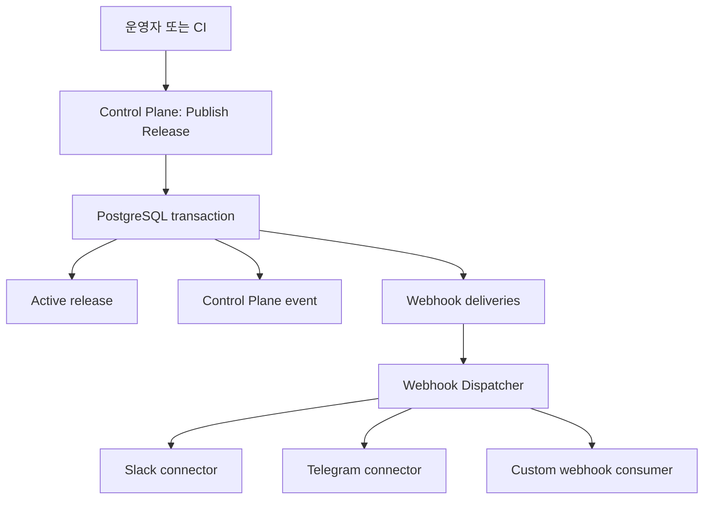

# ADR 0008: Control Plane 이벤트를 Transactional Webhook으로 전달

## Status

Accepted (2026-07-16). Dispatcher 프로세스 배치는 [ADR 0012](0012-server-worker-standalone-roles.md)가 갱신한다.

구현 순서는 [Control Plane Webhook 구현 계획](../release-webhook-implementation-plan.md)에서 관리한다.

## Context

운영자는 앱 릴리즈가 worker에 노출되는 시점을 Slack, Telegram, 사내 메신저 또는 자동화 서비스에서 확인할 필요가 있다. 릴리즈 알림은 단순 UI 편의 기능이 아니라 다음 운영 요구를 가진다.

- 릴리즈 API 응답과 실제 활성 릴리즈가 일치해야 한다.
- 메신저나 외부 수신자의 장애가 릴리즈를 실패시키거나 지연시키면 안 된다.
- 프로세스가 재시작되어도 전달할 이벤트가 사라지면 안 된다.
- 실패한 전달을 재시도하고 운영자가 이력을 확인할 수 있어야 한다.
- Slack이나 Telegram의 인증 및 메시지 형식이 Control Plane 도메인에 섞이면 안 된다.
- 이벤트 본문과 전달 이력에 Git 인증정보, 고객 키, 실행 입력값 같은 민감정보가 포함되면 안 된다.

Control Plane은 릴리즈 발행, 활성 릴리즈 선택, 감사 이력의 소유자다. 따라서 `release.published` 이벤트의 발생 여부와 내용도 Control Plane이 결정해야 한다. Runtime Worker와 Execution API는 이미 확정된 릴리즈를 소비하므로 릴리즈 이벤트를 발행하지 않는다.

## Decision

### 1. Control Plane은 범용 Webhook만 소유한다

Windforce Core core는 도메인 이벤트, Webhook 구독, 전달 상태와 재시도를 소유한다. Slack, Telegram 등 메신저별 인증과 메시지 렌더링은 별도 notifier connector가 소유한다.



제품별 connector는 Windforce 이벤트를 해당 제품의 메시지와 인증 방식으로 변환한다. 별도 connector 없이 Windforce Webhook 계약을 직접 소비하는 서비스도 허용한다.

### 2. 활성 릴리즈 변경과 이벤트를 같은 트랜잭션에 기록한다

Git fetch, source validation과 immutable bundle materialization은 데이터베이스 트랜잭션 전에 끝낸다. 트랜잭션에는 bundle 자체가 아니라 검증된 bundle reference를 저장한다. 트랜잭션이 실패해 참조되지 않는 bundle은 retention 작업에서 정리한다.

`windforce.release.published` 이벤트는 다음 상태가 한 PostgreSQL 트랜잭션에서 확정될 때 생성한다.

1. 릴리즈 레코드와 materialized contract reference가 저장된다.
2. 앱의 active release가 새 릴리즈를 가리킨다.
3. repository source의 마지막 릴리즈 marker가 갱신된다.
4. 감사 이벤트가 저장된다.
5. Control Plane 이벤트와 당시 구독에 대한 Webhook delivery가 저장된다.

외부 HTTP 호출은 이 트랜잭션에서 수행하지 않는다. 트랜잭션이 rollback되면 릴리즈 이벤트와 delivery도 존재하지 않는다. 트랜잭션이 commit되면 외부 수신자가 응답하지 않아도 릴리즈는 정상적으로 활성화된다.

운영 PostgreSQL backend에서는 active release catalog, release history, source marker, audit, event와 delivery를 같은 transactional store가 소유한다. 파일 catalog와 분리된 PostgreSQL outbox를 조합한 상태는 이 원자성 계약을 만족하지 않는다.

### 3. 이벤트 계약은 CloudEvents 1.0 호환 JSON envelope를 사용한다

첫 번째 도메인 이벤트 타입은 `windforce.release.published`다.

```json
{
  "specversion": "1.0",
  "id": "<EVENT_ID>",
  "type": "windforce.release.published",
  "source": "/workspaces/<WORKSPACE>/control-plane",
  "subject": "apps/<APP_KEY>/releases/<RELEASE_ID>",
  "time": "2026-07-16T10:00:00Z",
  "datacontenttype": "application/json",
  "data": {
    "workspace": "<WORKSPACE>",
    "app_key": "<APP_KEY>",
    "release_id": "<RELEASE_ID>",
    "commit": "<COMMIT_SHA>",
    "previous_release_id": "<PREVIOUS_RELEASE_ID>",
    "previous_commit": "<PREVIOUS_COMMIT_SHA>",
    "actor": "<ACTOR>",
    "note": "Release note"
  }
}
```

이벤트 계약은 다음 규칙을 따른다.

- `id`는 전역적으로 고유하며 전달 재시도에서도 바뀌지 않는다.
- 같은 이벤트를 여러 구독으로 전달할 때 event body는 동일하다.
- 선택 필드는 생략하거나 `null`로 표현하는 규칙을 event type별 schema에서 고정한다.
- 하위 호환 필드 추가는 같은 event type에서 허용한다.
- 필드 제거나 의미 변경은 새 event type을 사용한다.
- `actor`는 인증 principal 또는 canonical audit context에서 가져오며 release request body의 임의 문자열을 신뢰하지 않는다.
- `note`는 Webhook으로 전달되는 운영자 입력임을 릴리즈 화면과 API에 명시한다.
- Git credential, Webhook secret, 외부 고객 키, 실행 input/output은 포함하지 않는다.

### 4. 구독은 workspace 범위에서 event와 app을 필터링한다

Webhook subscription은 다음 값을 가진다.

| 속성 | 의미 |
|---|---|
| Name | 운영자가 식별하는 이름 |
| Endpoint | 이벤트를 받을 HTTPS URL |
| Event types | 구독할 Control Plane event type 목록 |
| App filter | 전체 앱 또는 선택 앱 목록 |
| Signing secret | 요청 검증용 HMAC secret |
| Enabled | 신규 delivery 생성 여부 |

구독을 비활성화하면 신규 delivery를 만들지 않는다. 이미 생성된 pending/retrying delivery는 일시 중지하고, 다시 활성화하면 재개한다. 구독 삭제는 soft delete이며 대기 중인 delivery는 `canceled`로 종료한다. 전송 이력의 보존 기간이 끝난 뒤에만 구독을 물리적으로 삭제한다.

### 5. 전달은 at-least-once이며 수신자가 중복을 제거한다

Webhook Dispatcher는 PostgreSQL에서 delivery를 lease로 claim하고 HTTP 요청을 전송한다.

- 성공은 HTTP `2xx` 응답이다.
- 네트워크 오류, timeout, `408`, `425`, `429`, `5xx`는 backoff와 jitter를 적용해 재시도한다.
- 그 외 `4xx`는 설정 또는 계약 오류로 보고 자동 재시도를 종료한다.
- `429`의 유효한 `Retry-After`는 기본 backoff보다 우선한다.
- 최대 시도 횟수를 넘긴 delivery는 terminal failure가 된다.
- 운영자는 terminal failure를 수동으로 다시 enqueue할 수 있다.

동일 event가 수신자에게 한 번 이상 도착할 수 있다. 수신자는 `X-Windforce-Delivery` 또는 event `id`를 idempotency key로 사용한다. Exactly-once 전달은 보장하지 않는다.

서로 다른 구독이나 이벤트 사이의 전역 전달 순서는 보장하지 않는다. 한 수신자가 순서에 의존해야 한다면 event `time`, release ID와 이전 릴리즈 참조를 사용해 자체적으로 검증한다.

### 6. Dispatcher는 별도 process role이다

운영 환경은 Control Plane API와 Webhook Dispatcher를 별도 프로세스로 실행한다.

```text
windforce-core control-plane
windforce-core webhook-dispatcher
```

두 프로세스는 같은 PostgreSQL state를 사용한다. Dispatcher는 inbound public API를 노출하지 않는다. `standalone`은 개발과 smoke test를 위해 Dispatcher loop를 같은 프로세스에서 실행할 수 있다.

### 7. 요청은 HMAC으로 서명하고 egress를 제한한다

Dispatcher는 다음 헤더를 전송한다.

| Header | 값 |
|---|---|
| `X-Windforce-Event` | event ID |
| `X-Windforce-Event-Type` | event type |
| `X-Windforce-Delivery` | delivery ID |
| `X-Windforce-Timestamp` | Unix timestamp |
| `X-Windforce-Signature` | `v1=<HMAC-SHA256>` |
| `Content-Type` | `application/cloudevents+json` |

서명 입력은 `<timestamp>.<raw-body>`다. 수신자는 timestamp 허용 범위를 확인한 뒤 raw body 기준으로 서명을 검증한다.

Endpoint URL과 signing secret은 기존 workspace secret encryption을 사용해 저장한다. API 응답과 UI는 secret, URL credential, 민감한 path/query를 다시 노출하지 않는다.

Outbound 요청은 다음 정책을 적용한다.

- redirect를 따르지 않는다.
- registration과 delivery 시점 모두 URL과 resolve된 주소를 검증한다.
- delivery는 검증한 IP로 직접 연결하고 원래 hostname을 TLS SNI와 HTTP Host에 유지해 DNS rebinding을 차단한다.
- loopback, link-local, cloud metadata 주소는 기본 차단한다.
- private network endpoint는 명시적인 host/CIDR allowlist로 허용한다.
- 운영 기본값은 HTTPS만 허용한다.
- 로컬 개발에서만 명시적인 옵션으로 loopback HTTP를 허용한다.
- 응답 body는 최대 64 KiB까지만 읽고 폐기한다. status, latency와 표준화된 오류 요약만 기록한다.

### 8. Web UI는 설정과 전달 이력을 제공한다

`Settings > Webhooks`에서 다음 운영 기능을 제공한다.

- 구독 생성, 수정, 비활성화와 삭제
- event type과 app filter 설정
- test event 전송
- 최근 delivery 상태, 시도 횟수와 마지막 오류 확인
- 실패 delivery 수동 재시도

구독 변경과 수동 재시도는 canonical audit에 기록한다. Delivery 이력은 전송 운영 데이터이며 audit log 자체를 대신하지 않는다.

### 9. Dispatcher가 관측성과 delivery 보존을 소유한다

전용 Dispatcher는 Prometheus metrics listener를 제공한다. `standalone`은 기존 HTTP listener의 `/metrics`를 사용한다. Metric label은 event type, delivery state와 attempt outcome으로 제한하며 endpoint, subscription, app key와 delivery ID를 사용하지 않는다.

Dispatcher retention loop는 succeeded/canceled delivery를 기본 30일, failed delivery를 기본 90일 보존한다. pending, retrying과 delivering 상태는 삭제하지 않는다. Event는 모든 delivery가 삭제된 뒤, soft-deleted subscription은 참조 delivery가 없어진 뒤에만 물리 삭제한다. 정리는 batch 크기와 실행 시간 예산으로 제한하며 terminal TTL `0`은 해당 규칙을 비활성화한다.

## Non-goals

- Control Plane 안에서 Slack Block Kit 또는 Telegram Bot API payload를 생성하지 않는다.
- Runtime Worker와 Execution API의 job/run 이벤트를 이 ADR 범위에 포함하지 않는다.
- Webhook 수신 실패를 릴리즈 실패로 바꾸지 않는다.
- Exactly-once delivery를 제공하지 않는다.
- Webhook을 장기 보존 event streaming platform으로 사용하지 않는다.

## Alternatives Considered

### 릴리즈 요청에서 Webhook을 동기 호출

외부 장애가 릴리즈 latency와 성공 여부에 결합되며, transaction commit 전후의 상태를 일관되게 설명하기 어렵다. 선택하지 않는다.

### Control Plane에 Slack과 Telegram을 직접 구현

메신저별 credential, rate limit, message template과 API 변경이 Control Plane 도메인에 들어온다. 범용 Webhook과 별도 connector 경계를 선택한다.

### PostgreSQL `LISTEN/NOTIFY`만 사용

프로세스 재시작과 subscriber disconnect 동안 메시지가 보존되지 않는다. Wake-up 최적화로는 사용할 수 있지만 source of truth로 사용하지 않는다.

### Kafka, NATS 또는 RabbitMQ 도입

현재 필요한 기능은 낮은 빈도의 Control Plane event와 재시도 가능한 HTTP delivery다. PostgreSQL 외에 별도 운영 시스템을 추가할 근거가 부족하므로 선택하지 않는다.

## Consequences

- 릴리즈와 event 생성의 일관성을 PostgreSQL transaction으로 보장한다.
- 외부 수신자 장애가 릴리즈를 막지 않는다.
- Webhook delivery 상태와 재시도를 운영자가 추적할 수 있다.
- 메신저뿐 아니라 배포 후속 자동화가 같은 계약을 사용할 수 있다.
- PostgreSQL schema, Dispatcher process, egress 보안 설정과 delivery retention 운영이 추가된다.
- 수신자는 event ID 기반 중복 제거를 구현해야 한다.
- Slack과 Telegram 알림을 사용하려면 별도 notifier connector가 필요하다.
