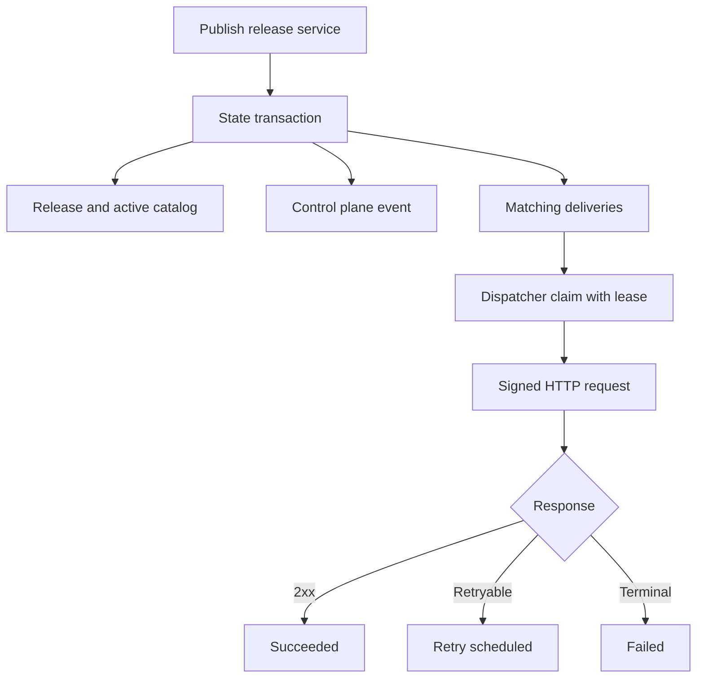

# Control Plane Release Webhook 구현 계획

## 문서 상태

- 상태: In progress
- 결정 문서: [ADR 0008](adr/0008-control-plane-event-webhooks.md)
- 구현 소유: `windforce-lite` Control Plane
- 제품별 메시지 소유: 별도 notifier connector

이 문서는 앱 릴리즈 이벤트를 내구성 있는 범용 Webhook으로 전달하기 위한 구현 순서와 완료 조건을 정의한다. 각 단계는 독립적으로 리뷰하고 검증할 수 있는 issue와 commit으로 나눈다.

## 목표

1. 활성 릴리즈와 `windforce.release.published` event를 원자적으로 기록한다.
2. 외부 endpoint 장애와 무관하게 릴리즈를 완료한다.
3. 재시작 후에도 pending delivery를 이어서 처리한다.
4. 구독, 실패 이력과 수동 재시도를 Control Plane API와 Web UI에서 관리한다.
5. Slack, Telegram과 사내 메신저가 동일한 event contract를 소비할 수 있게 한다.

## 범위 밖

- job/run 상태 알림
- 메신저별 message template editor
- customer별 알림 정책
- event replay stream 또는 범용 message broker
- Slack/Telegram connector의 source ownership과 배포 정책

## 핵심 불변 조건

- 릴리즈 transaction이 rollback되면 event와 delivery가 남지 않는다.
- Webhook HTTP 요청은 릴리즈 transaction 안에서 실행하지 않는다.
- Dispatcher는 Git credential과 release bundle을 읽지 않는다.
- Endpoint와 signing secret 평문은 API, log, audit detail에 남지 않는다.
- 동일 delivery의 event body와 event ID는 모든 재시도에서 동일하다.
- 수동 재시도는 새 attempt를 만들지만 원 event ID를 유지한다.
- 구독 필터는 delivery 생성 시점에 확정한다.
- 운영 PostgreSQL backend에서 active release, history, source marker, audit, event와 delivery는 한 transaction에 참여한다.
- bundle materialization은 transaction 전에 끝내고, 참조되지 않는 bundle은 retention으로 정리한다.

## 구현 구조



권장 package 경계:

```text
internal/event       event type, envelope, schema validation
internal/webhook     subscription, signature, request policy, delivery state
internal/state       transactional event/delivery persistence and claim lease
internal/controlapi  subscription and delivery management endpoints
cmd/windforce-lite   webhook-dispatcher process mode
web/src              Webhook settings and delivery history UI
```

## 0단계: 릴리즈 catalog를 Transactional Store로 통합

- 상태: In progress ([transactional store #69](https://github.com/imprun/windforce-lite/issues/69))

현재 release path는 source를 materialize한 뒤 file catalog를 갱신하고 repository source marker를 별도 저장한다. 이 경계에서는 active release, audit와 outbox를 하나의 PostgreSQL transaction으로 묶을 수 없다. Webhook 구현 전에 release publication의 저장 경계를 통합한다.

### 작업

- `syncer.Sync`를 source validation과 immutable bundle materialization까지만 담당하도록 분리한다.
- release publication service가 다음 상태 변경을 한 번에 요청하도록 만든다.

```go
type ReleaseTx interface {
    PutRelease(ctx context.Context, release ReleaseRecord) error
    SetActiveRelease(ctx context.Context, workspaceID string, appKey string, releaseID string) error
    MarkSourceReleased(ctx context.Context, sourceID string, commit string, releasedAt time.Time) error
    AppendAudit(ctx context.Context, event AuditEvent) error
    AppendControlPlaneEvent(ctx context.Context, event ControlPlaneEvent) error
    CreateMatchingWebhookDeliveries(ctx context.Context, event ControlPlaneEvent) error
}

type TransactionalReleaseStore interface {
    WithReleaseTransaction(ctx context.Context, fn func(ReleaseTx) error) error
}
```

- PostgreSQL backend에서 active release catalog와 release history를 source of truth로 만든다.
- Execution API와 Control Plane 조회는 같은 release store를 사용한다.
- local backend는 하나의 lock과 atomic snapshot replace로 같은 service contract를 구현한다. 다중 process 원자성은 PostgreSQL backend만 보장한다.
- 현재 catalog와 release history를 PostgreSQL로 옮기는 idempotent import 검증 경로를 제공한다.
- transaction 실패로 참조되지 않는 materialized bundle을 찾고 정리할 수 있게 bundle reference 조회와 retention을 추가한다.

### 완료 조건

- PostgreSQL integration test가 active release, history, source marker와 audit의 원자성을 검증한다.
- 각 write 단계에서 의도적으로 실패시켜 부분 갱신이 남지 않음을 검증한다.
- Execution API가 PostgreSQL active release를 resolve하고 기존 self-pin 동작을 유지한다.
- 동일 catalog snapshot을 import해도 release/history가 중복되지 않는다.
- local backend와 PostgreSQL backend가 같은 release publication contract test를 통과한다.

## 1단계: Event 계약과 상태 인터페이스

- 상태: Completed ([#71](https://github.com/imprun/windforce-lite/issues/71))

### 작업

- `windforce.release.published` Go contract와 CloudEvents JSON fixture를 정의한다.
- event type별 payload validator를 만든다.
- ID 생성 규칙을 정한다: `evt_`와 `whd_` prefix를 가진 opaque ID.
- 다음 state interface를 추가한다.

```go
type WebhookStore interface {
    ListSubscriptions(ctx context.Context, workspaceID string) ([]WebhookSubscription, error)
    CreateSubscription(ctx context.Context, subscription WebhookSubscription) error
    UpdateSubscription(ctx context.Context, subscription WebhookSubscription) error
    DeleteSubscription(ctx context.Context, workspaceID string, subscriptionID string) error
    ClaimDelivery(ctx context.Context, workerID string, leaseTTL time.Duration) (*WebhookDelivery, error)
    CompleteDelivery(ctx context.Context, lease DeliveryLease, result DeliveryResult) error
    RetryDelivery(ctx context.Context, workspaceID string, deliveryID string, actor string) error
}
```

Event와 matching delivery 생성은 0단계의 `ReleaseTx`에 참여한다. `WebhookStore`는 구독 관리와 Dispatcher용 lease operation만 제공하며 release transaction을 시작하지 않는다.

### 완료 조건

- event JSON golden test가 CloudEvents 필수 필드와 민감정보 제외를 검증한다.
- event ID와 delivery ID가 충돌 없이 생성된다.
- 지원하지 않는 event type과 잘못된 payload가 저장 전에 거부된다.

## 2단계: PostgreSQL Outbox schema와 Local Store

- 상태: Completed ([#71](https://github.com/imprun/windforce-lite/issues/71))

### PostgreSQL schema

```sql
CREATE TABLE control_plane_event (
    id TEXT PRIMARY KEY,
    workspace_id TEXT NOT NULL,
    event_type TEXT NOT NULL,
    subject TEXT NOT NULL,
    body JSONB NOT NULL,
    created_at TIMESTAMPTZ NOT NULL DEFAULT now()
);

CREATE TABLE webhook_subscription (
    id TEXT PRIMARY KEY,
    workspace_id TEXT NOT NULL,
    name TEXT NOT NULL,
    endpoint_encrypted JSONB NOT NULL,
    signing_secret_encrypted JSONB NOT NULL,
    event_types JSONB NOT NULL,
    app_keys JSONB NOT NULL,
    enabled BOOLEAN NOT NULL DEFAULT true,
    created_by TEXT NOT NULL,
    updated_by TEXT NOT NULL,
    created_at TIMESTAMPTZ NOT NULL DEFAULT now(),
    updated_at TIMESTAMPTZ NOT NULL DEFAULT now(),
    deleted_at TIMESTAMPTZ
);

CREATE UNIQUE INDEX webhook_subscription_active_name_idx
    ON webhook_subscription (workspace_id, name)
    WHERE deleted_at IS NULL;

CREATE TABLE webhook_delivery (
    id TEXT PRIMARY KEY,
    workspace_id TEXT NOT NULL,
    event_id TEXT NOT NULL REFERENCES control_plane_event(id),
    subscription_id TEXT NOT NULL REFERENCES webhook_subscription(id),
    state TEXT NOT NULL,
    attempt INTEGER NOT NULL DEFAULT 0,
    next_attempt_at TIMESTAMPTZ NOT NULL DEFAULT now(),
    lease_owner TEXT,
    lease_expires_at TIMESTAMPTZ,
    response_status INTEGER,
    latency_ms BIGINT,
    error_summary TEXT,
    created_at TIMESTAMPTZ NOT NULL DEFAULT now(),
    updated_at TIMESTAMPTZ NOT NULL DEFAULT now(),
    completed_at TIMESTAMPTZ,
    UNIQUE (event_id, subscription_id)
);
```

필수 index:

- claim: `(state, next_attempt_at, created_at)` for pending/retrying
- lease recovery: `(lease_expires_at)` for delivering
- subscription history: `(workspace_id, subscription_id, created_at DESC)`
- event lookup: `(workspace_id, event_type, created_at DESC)`

### 암호화

- `endpoint_encrypted`와 `signing_secret_encrypted`는 workspace DEK를 사용한다.
- `SECRET_KEY`와 `SECRET_KEY_PREVIOUS` rotation 경로를 기존 secret variable과 공유한다.
- UI/API summary에는 endpoint scheme과 host만 제공하고 path/query는 masking한다.

### Local Store

- subscription, event와 delivery를 snapshot에 저장한다.
- local backend는 contract test와 standalone 개발을 지원한다.
- process crash 사이의 원자성과 다중 Dispatcher lease 보장은 PostgreSQL backend의 운영 계약이다.

### 완료 조건

- migration이 빈 DB와 데이터가 있는 DB에서 모두 적용된다.
- 동일 event/subscription delivery 중복 생성이 unique constraint로 차단된다.
- lease 만료 delivery가 다시 claim된다.
- 암호화 설정이 없을 때 secret 평문 저장을 허용하지 않는다.

## 3단계: 릴리즈 발행과 Outbox 연결

- 상태: Completed ([#71](https://github.com/imprun/windforce-lite/issues/71))

### 작업

릴리즈 발행 service를 하나의 transaction boundary로 정리한다.

```text
Validate source and manifest
  -> materialize release
  -> begin state transaction
  -> insert release
  -> update active release
  -> append audit
  -> append release event
  -> create matching deliveries
  -> commit
```

구독 matching 규칙:

1. 같은 workspace다.
2. 구독이 enabled다.
3. `windforce.release.published`가 event type filter에 있다.
4. app filter가 비어 있거나 현재 app key를 포함한다.
5. 구독이 soft delete되지 않았다.

Event payload의 `previous_release_id`와 `previous_commit`은 transaction 시작 후 active release를 lock하여 결정한다.

### 완료 조건

- 릴리즈 commit과 event/delivery 생성이 integration test 한 transaction에서 검증된다.
- 의도적으로 transaction을 실패시키면 release, audit, event와 delivery가 모두 rollback된다.
- 구독이 없을 때도 릴리즈가 정상적으로 완료된다.
- 100개 matching subscription에서도 외부 HTTP 호출 없이 transaction이 완료된다.

## 4단계: Webhook Dispatcher

- 상태: Completed ([#72](https://github.com/imprun/windforce-lite/issues/72))

### Process mode

```text
windforce-lite webhook-dispatcher \
  --state-backend postgres \
  --database-url "$WINDFORCE_LITE_DATABASE_URL"
```

`standalone`은 같은 dispatcher loop를 내부에서 시작한다. 운영 Compose와 Kubernetes manifest는 전용 process를 실행한다.

### Claim과 상태 전이

```text
pending/retrying
  -> delivering with lease
  -> succeeded
  -> retrying with next_attempt_at
  -> failed
  -> canceled
```

PostgreSQL claim은 `FOR UPDATE SKIP LOCKED`를 사용한다. Dispatcher heartbeat 또는 충분히 짧은 request timeout으로 lease를 유지한다. 만료된 `delivering` delivery는 reaper가 `retrying`으로 되돌린다.

구독 disable은 pending/retrying delivery를 claim 대상에서 제외한다. 다시 enable하면 같은 delivery를 재개한다. 구독 delete는 soft delete이며 pending/retrying delivery를 `canceled`로 바꾼다. 이미 HTTP 요청을 시작한 delivery는 완료를 기록하되 이후 재시도하지 않는다.

### 기본 전달 정책

| 항목 | 기본값 |
|---|---|
| HTTP timeout | 10초 |
| 최대 attempt | 8회 |
| 최대 response body read | 64 KiB, 읽은 뒤 폐기 |
| Redirect | 비활성화 |
| User-Agent | `windforce-lite-webhook/<VERSION>` |
| Backoff | exponential + jitter, 최대 24시간 |

Retry 분류:

- retry: network error, timeout, `408`, `425`, `429`, `5xx`
- success: 모든 `2xx`
- terminal: 그 외 `4xx`, URL/security policy failure, payload signing failure

### 완료 조건

- process restart 후 pending/retrying delivery를 이어서 전송한다.
- 두 Dispatcher가 같은 delivery를 동시에 claim하지 않는다.
- 같은 delivery의 재시도 body와 event ID가 동일하다.
- 서로 다른 delivery 사이의 전역 순서를 가정하지 않는 concurrent delivery test가 존재한다.
- `Retry-After`, 최대 attempt와 lease recovery가 clock-controlled test로 검증된다.
- Webhook endpoint가 느리거나 실패해도 release API latency에 영향을 주지 않는다.

## 5단계: Egress 보안과 서명

- 상태: Completed ([#72](https://github.com/imprun/windforce-lite/issues/72))

### URL 정책

- URL parse 시 userinfo를 거부한다.
- 운영 기본값은 `https`만 허용한다.
- redirect를 따르지 않는다.
- DNS resolve 결과의 모든 IP를 검사한다.
- loopback, link-local, multicast와 cloud metadata 대역을 차단한다.
- private network는 config의 host/CIDR allowlist로만 허용한다.
- delivery 직전에도 resolve와 policy 검사를 반복한다.
- 검증한 IP로 직접 연결하고 원래 hostname을 TLS SNI와 HTTP Host에 사용한다.
- 로컬 개발은 `WINDFORCE_LITE_WEBHOOK_ALLOW_INSECURE_LOOPBACK=true`로만 HTTP loopback을 허용한다.

### HMAC

```text
signed = X-Windforce-Timestamp + "." + rawRequestBody
signature = hex(HMAC-SHA256(signingSecret, signed))
header = "v1=" + signature
```

Test fixture는 고정 timestamp, secret과 body로 언어 중립적인 예상 signature를 제공한다.

### 완료 조건

- URL parser, DNS 결과, redirect와 IP class별 security test가 존재한다.
- Endpoint와 secret은 log, error, audit와 API response에 평문으로 나타나지 않는다.
- 응답 body는 저장하거나 log에 남기지 않고 크기가 제한된 read 후 표준 error code와 summary로 변환한다.
- key rotation 중 현재 키와 직전 키로 저장 데이터를 읽을 수 있다.

## 6단계: Control Plane API와 Audit

### API

```text
GET    /api/w/{workspace}/webhooks
POST   /api/w/{workspace}/webhooks
GET    /api/w/{workspace}/webhooks/{webhook_id}
PATCH  /api/w/{workspace}/webhooks/{webhook_id}
DELETE /api/w/{workspace}/webhooks/{webhook_id}
POST   /api/w/{workspace}/webhooks/{webhook_id}/test
GET    /api/w/{workspace}/webhooks/{webhook_id}/deliveries
GET    /api/w/{workspace}/webhook-deliveries/{delivery_id}
POST   /api/w/{workspace}/webhook-deliveries/{delivery_id}/retry
```

API 응답은 endpoint의 scheme과 host만 `<SCHEME>://<HOST>` 형태로 반환한다. path, query와 fragment는 반환하지 않는다. Signing secret은 생성 또는 rotation 응답에서만 한 번 표시한다. 저장된 secret을 다시 조회하는 API는 제공하지 않는다.

`test`는 선택한 subscription에만 `windforce.webhook.test` event와 delivery를 생성한다. 실제 릴리즈 event를 위조하지 않는다.

Audit event:

- `webhook_subscription_created`
- `webhook_subscription_updated`
- `webhook_subscription_disabled`
- `webhook_subscription_enabled`
- `webhook_subscription_deleted`
- `webhook_test_requested`
- `webhook_delivery_retried`

Audit detail에는 subscription ID, 이름, event/app filter 변경 요약만 기록한다.

`DELETE`는 구독을 soft delete하고 pending/retrying delivery를 `canceled`로 종료한다. 삭제된 구독과 delivery 이력은 보존 기간 동안 조회 가능하지만 수정, test와 수동 retry는 허용하지 않는다. 물리 삭제는 retention loop만 수행한다.

### 완료 조건

- workspace isolation과 admin authentication test가 존재한다.
- URL/secret masking snapshot test가 존재한다.
- disabled subscription은 test와 신규 delivery 생성을 거부한다.
- 수동 retry actor가 canonical audit에 기록된다.

## 7단계: Web UI

### Information architecture

```text
Settings
  -> Webhooks
     -> Subscription list
     -> Subscription detail
        -> Configuration
        -> Delivery history
```

목록은 다음 정보를 한 행에 표시한다.

- 이름과 masked endpoint host
- enabled 상태
- event 수와 app filter 범위
- 최근 delivery 상태와 시각
- 최근 성공률 또는 실패 건수

상세 페이지는 구독 설정과 delivery history를 전체 폭으로 표시한다. Delivery 행은 상태, event, app, attempt, HTTP status, latency와 다음 retry 시각을 보여준다. 실패 상세는 sheet가 아니라 별도 상세 또는 행 확장으로 제공하며 secret과 raw response body는 표시하지 않는다.

필수 interaction:

- 구독 생성 전 endpoint validation
- signing secret 생성 또는 rotation
- test event 전송과 결과 자동 갱신
- enable/disable 확인
- 실패 delivery 수동 retry
- event type과 app filter 검색

### 완료 조건

- Vite 개발 서버 HMR에서 동작한다.
- desktop과 390px viewport에서 겹침과 가로 overflow가 없다.
- 100개 subscription과 1,000개 delivery fixture에서 검색과 페이지 이동이 유지된다.
- 성공, retrying, failed, disabled와 empty 상태의 Playwright 시나리오가 존재한다.
- UI 가이드 screenshot scenario를 추가한다.

## 8단계: 관측성, 보존과 운영 설정

### Metrics

```text
windforce_webhook_deliveries_total{event_type,state}
windforce_webhook_delivery_attempts_total{event_type,outcome}
windforce_webhook_delivery_latency_seconds{event_type}
windforce_webhook_pending_deliveries
windforce_webhook_oldest_pending_seconds
```

Endpoint, subscription name, app key와 delivery ID는 metric label로 사용하지 않는다. 구조화 log에는 delivery ID, event type, attempt, response status, duration과 outcome만 포함한다.

### 보존

- succeeded delivery: 기본 30일
- canceled delivery: 기본 30일
- failed delivery와 관련 event: 기본 90일
- pending/retrying/delivering: terminal 전까지 보존
- subscription이 참조하지 않는 event는 모든 delivery retention이 끝난 뒤 삭제

Retention loop는 batch delete와 실행 시간 제한을 사용한다. 설정값 `0`은 보존 기한을 비활성화한다.

### 운영 설정

```text
WINDFORCE_LITE_WEBHOOK_DISPATCH_INTERVAL
WINDFORCE_LITE_WEBHOOK_REQUEST_TIMEOUT
WINDFORCE_LITE_WEBHOOK_MAX_ATTEMPTS
WINDFORCE_LITE_WEBHOOK_LEASE_TTL
WINDFORCE_LITE_WEBHOOK_ALLOWED_HOSTS
WINDFORCE_LITE_WEBHOOK_ALLOWED_CIDRS
WINDFORCE_LITE_WEBHOOK_ALLOW_INSECURE_LOOPBACK
WINDFORCE_LITE_WEBHOOK_METRICS_ADDR
WINDFORCE_LITE_WEBHOOK_SUCCESS_RETENTION_DAYS
WINDFORCE_LITE_WEBHOOK_FAILURE_RETENTION_DAYS
WINDFORCE_LITE_WEBHOOK_RETENTION_INTERVAL
WINDFORCE_LITE_WEBHOOK_RETENTION_BATCH_SIZE
WINDFORCE_LITE_WEBHOOK_RETENTION_TIME_BUDGET
```

### 완료 조건

- pending age와 terminal failure를 dashboard/alert에서 감지할 수 있다.
- endpoint나 signing secret이 metric/log에 포함되지 않는다.
- retention이 pending delivery를 삭제하지 않는다.

## 9단계: Messenger Connector 통합 검증

Messenger connector는 별도 소유 repository와 deployable service로 구현한다. Windforce Lite는 다음 통합 자산만 소유한다.

- CloudEvents JSON schema와 fixture
- HMAC 검증 예제
- local test receiver
- connector contract test

첫 connector는 Slack Incoming Webhook 또는 Slack Bot API 중 하나를 선택해 `windforce.release.published`를 사람이 읽을 수 있는 메시지로 변환한다. Telegram connector는 같은 event fixture와 signature verifier를 재사용한다. Control Plane public URL이 connector에 설정된 경우에만 event subject를 상세 화면 링크로 변환한다.

### 완료 조건

- 실제 release publish에서 generic test receiver까지 end-to-end delivery가 성공한다.
- Slack connector smoke test에서 앱, commit, actor와 note를 확인하고, public URL이 설정된 경우 Control Plane 링크도 확인한다.
- connector 장애 중에도 release가 성공하고 Windforce delivery가 retrying으로 남는다.
- connector가 같은 event ID를 중복 수신해도 메시지를 중복 발송하지 않는다.

## Issue 분할안

| 순서 | Issue | 주요 산출물 |
|---|---|---|
| 1 | Transactional release store | catalog persistence, import, atomic publication |
| 2 | Event contract and state interfaces | event package, fixture, interfaces |
| 3 | PostgreSQL outbox and local store | migration, persistence, lease |
| 4 | Atomic release event emission | publish transaction integration |
| 5 | Webhook dispatcher | process mode, retry state machine |
| 6 | Webhook egress security | URL policy, HMAC, encryption |
| 7 | Control Plane webhook API | CRUD, test, delivery retry, audit |
| 8 | Webhook admin UI | settings pages, history, responsive UX |
| 9 | Metrics and retention | metrics, logs, cleanup loop |
| 10 | Messenger connector integration | fixtures, receiver, Slack smoke |

각 issue는 앞 단계의 contract를 변경하지 않고 확장한다. Schema나 event payload의 breaking change가 필요하면 ADR을 먼저 갱신한다.

## 전체 완료 조건

- 릴리즈 발행 transaction과 event/delivery 생성이 원자적이다.
- Dispatcher 중단과 재시작, 다중 replica와 lease 만료를 견딘다.
- endpoint 장애가 릴리즈 성공과 API latency에 영향을 주지 않는다.
- HMAC, SSRF 방어, secret encryption과 masking이 자동 테스트된다.
- 운영자가 Web UI에서 구독과 delivery 상태를 관리할 수 있다.
- generic receiver와 하나 이상의 messenger connector로 end-to-end 알림을 검증한다.
- 문서, API schema, CLI help와 UI guide가 구현 상태와 일치한다.
