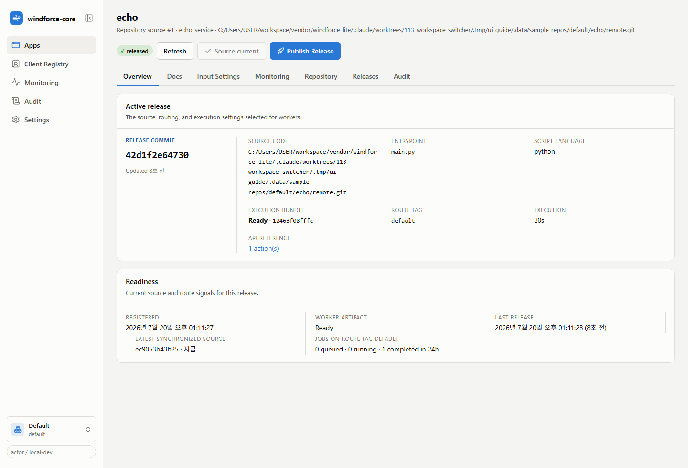
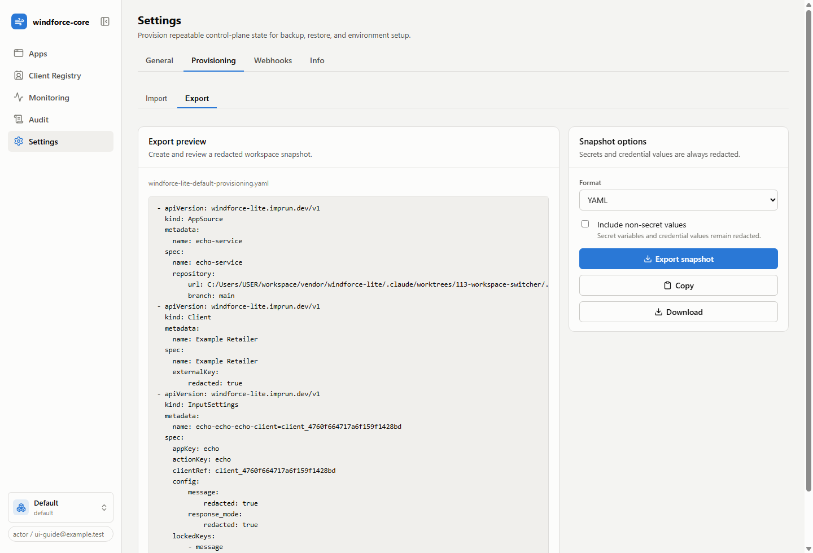
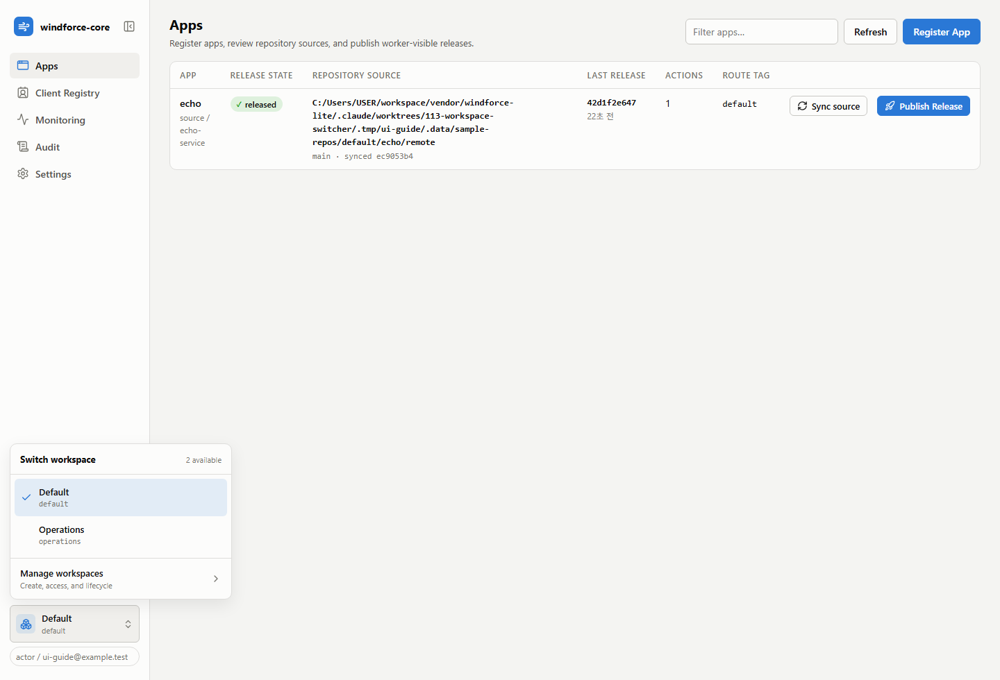
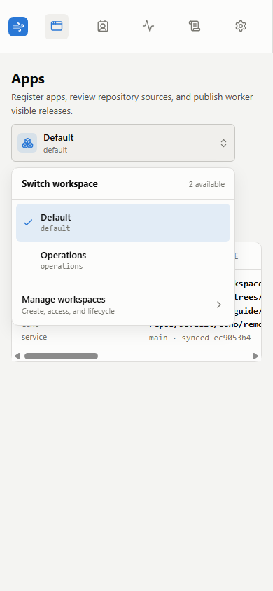
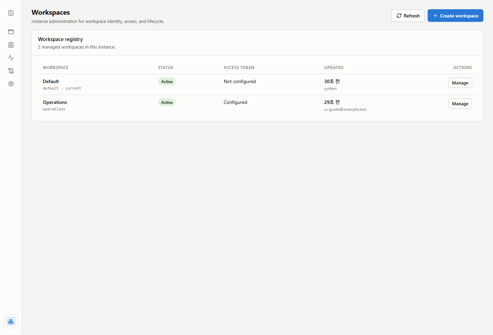
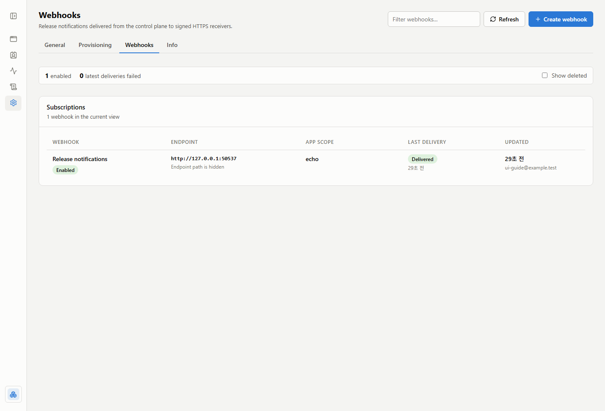
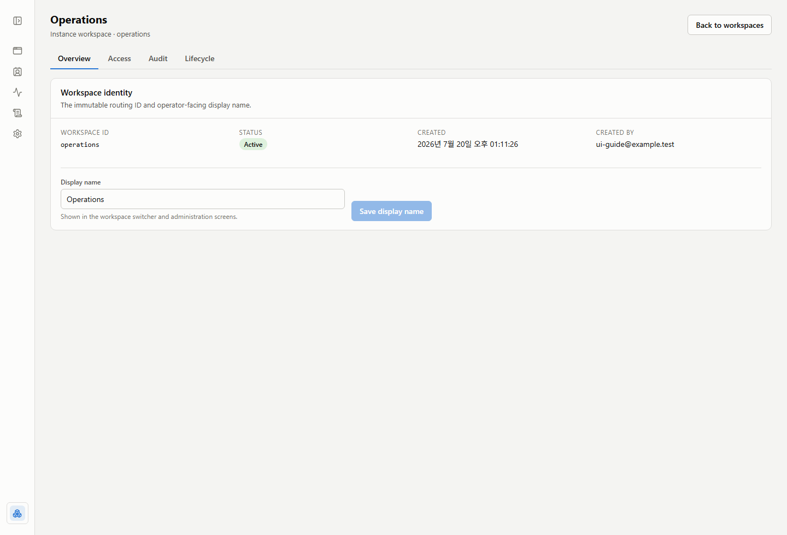
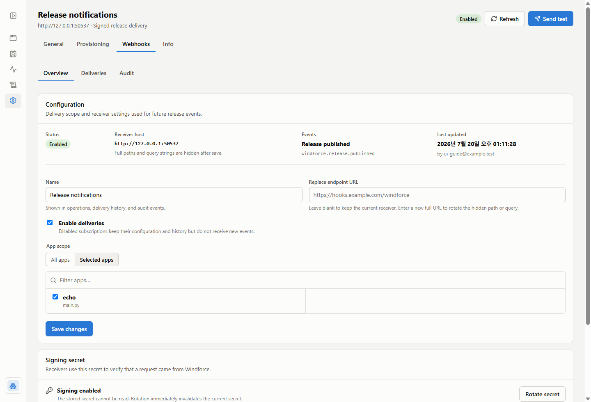
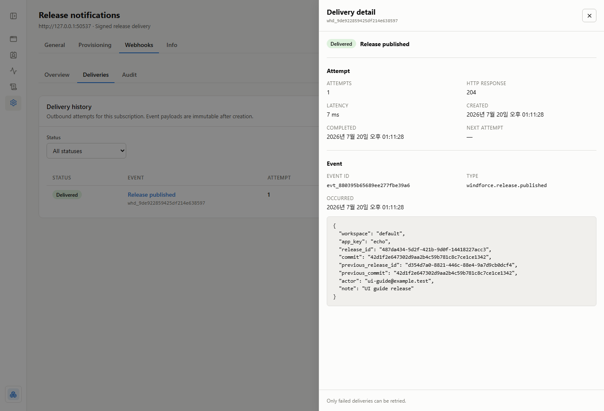
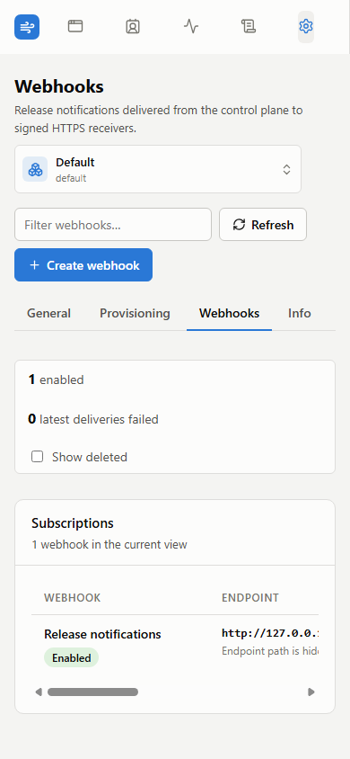

# windforce-core Web UI User Guide

<!-- Generated by `node tools/ui-guide/capture.mjs`. Edit `docs/ui-scenarios/*.mjs` instead. -->

This guide is generated from executable UI scenarios. Screenshots are captured from the local windforce-core devstack.

## Review registered apps

The Apps view is the home screen. Every row is one app: its release state, repository source, last release, and route tag.

1. Open the Web UI; the Apps view lists every registered app.
2. Check the release state badge: released apps have a worker-visible contract, registered apps do not yet.
3. Compare repository source, last release commit, action count, and route tag per app.
4. Select an app row or app name to open its full detail view, or publish a release from the row.

## Register an app

Register App points the control plane at a repository source. Registration validates repository access, branch, and windforce.json before saving.

1. Click Register App in the Apps view.
2. Enter the app name, repository URL, branch, and optional subpath.
3. Pick a git auth method or reference an existing credential variable path.
4. Use Probe repository to confirm reachability and branch existence before registering.

## Inspect an app

The app detail Overview tab shows the active release and readiness signals for workers.

1. Open an app from the Apps view.
2. Review the active release: app key, release commit, entrypoint, and update time.
3. Follow the source code link to browse the repository at the pinned release commit on GitHub/GitLab.
4. Use the tabs for repository settings, release history, and action schemas.

## Synchronize source

Sync source fetches the tracked branch, validates the source contract, and stores the exact revision without changing the active release.

1. Open an app and find Sync source next to Publish Release.
2. Click Sync source.
3. Confirm that Sync source changes to Source current and Publish Release becomes available when the commit changed.

## Publish a release

Publish Release prepares the latest synchronized source and publishes it as the worker-visible contract, recorded with the audit actor.

1. Open an app and click Publish Release.
2. Compare Active release with Latest synchronized.
3. Add a release note for the audit trail.
4. Publish the latest synchronized revision; the release history records the actor, commit, and note.

## Review release history

The Releases tab is the publish history of the worker-visible contract: who published which commit, from which source, and why. Configuration changes live on the Audit tab.

1. Open an app and switch to the Releases tab.
2. Each release record shows the actor, commit, source, release id, and note.
3. Use it to answer who published which contract, and when; configuration changes are on the Audit tab.

## Review action schemas

The Docs tab shows each action's release-pinned input and output JSON Schemas.

1. Open an app and switch to the Docs tab.
2. Choose an action from the API reference.
3. Review its request and result fields or download the source JSON Schema.

## Monitor one app

The app detail Monitoring tab narrows the workspace job aggregates to a single app: queued and running now, plus completed, failed, canceled, and the failure rate in the selected window.

1. Open an app and switch to the Monitoring tab.
2. Read the tiles for this app's queued, running, and windowed completed/failed/canceled counts.
3. Switch the window between 1h, 24h, and 7d.
4. Watch the failure rate; the workspace-wide picture lives on the Monitoring page.

## Audit configuration changes

The Audit tab records who changed the app's configuration: repository settings edits, source deletion, and route tag overrides. Releases have their own history on the Releases tab.

1. Open an app and switch to the Audit tab.
2. Each record shows the actor, the kind of change, and the changed fields.
3. Use it together with the Releases tab to answer who changed what, and when.

## Monitor job activity

The Monitoring view aggregates job activity for the whole workspace: totals, per-app and per-route-tag breakdowns, and failure rates. Individual runs are an API/CLI concern.

1. Open Monitoring from the sidebar.
2. Read the tiles: queued and running now, plus completed, failed, and canceled runs in the selected window.
3. Switch the window between 1h, 24h, and 7d.
4. Use the by-app and by-route-tag tables to find where the failure rate is moving; app names link to the app detail.

## Import and export provisioning state

Provisioning exports a redacted workspace snapshot and imports repeatable app, credential, client, input-setting, and webhook resources through dry-run first.

1. Open Settings from the sidebar and choose Provisioning.
2. Export the current workspace as YAML or JSON for review.
3. Paste or load a provisioning document, run Dry-run, then Apply only after validation succeeds.

## Set API access and audit context

General settings holds the API token and local audit actor used by Web UI requests. Values are stored in the browser.

1. Open Settings from the sidebar.
2. Set the API token when the control plane requires authentication.
3. Set the audit actor recorded on releases and cancels; local development defaults to local-dev.

## Switch workspace context

The workspace switcher identifies the current scope, lists available workspaces, and provides the entry point to instance workspace administration.

1. Open the workspace control at the bottom of the sidebar.
2. Select a workspace to change the active application and monitoring scope.
3. Choose Manage workspaces to create workspaces or manage identity, access, audit, and lifecycle settings.

## Switch workspace on a narrow screen

The current workspace remains visible below the page title and opens the same context and administration menu on narrow screens.

1. Open the workspace control below the page title.
2. Choose another workspace or open Manage workspaces without returning to desktop navigation.

## Collapse the sidebar

The sidebar collapses to an icon rail so wide tables get the full viewport. The choice is remembered in the browser.

1. Click the collapse control beside the product title at the top of the sidebar.
2. Navigate with the icon rail; hover shows each destination.
3. Click the control again to expand the sidebar.

## Manage workspaces

The workspace registry is the instance-admin surface for workspace identity, status, scoped access, and lifecycle operations.

1. Open the workspace switcher at the bottom of the sidebar.
2. Choose Manage workspaces to review the instance registry.
3. Create a workspace or open a workspace's dedicated administration page.
4. Use an instance-admin token for workspace lifecycle operations; workspace tokens remain scoped to one workspace.

## Manage release webhooks

The Webhooks settings view shows each signed release receiver, its app scope, and the latest delivery outcome without exposing endpoint paths or secrets.

1. Open Settings and choose Webhooks.
2. Review each receiver's status, masked endpoint, app scope, latest delivery, and last operator update.
3. Open a webhook name to manage its configuration and delivery history.

## Administer a workspace

Each workspace has a dedicated administration page that separates identity, access, audit, and lifecycle responsibilities.

1. Open Manage workspaces from the workspace switcher, then choose a workspace from the registry.
2. Use Overview for its display name, Access for its scoped token, Audit for lifecycle history, and Lifecycle for archive controls.
3. Return to the workspace switcher when changing the active workspace for workspace-scoped operations.

## Configure a release webhook

Webhook detail keeps receiver configuration, app scope, enablement, secret rotation, and deletion controls on a full page.

1. Open a webhook from Settings.
2. Review its masked receiver, event type, status, and last operator update.
3. Change its name, replace the endpoint, enable or disable delivery, or narrow the app scope.
4. Rotate the signing secret only when the receiver can be updated immediately.

## Inspect a webhook delivery

Delivery history exposes status, response, attempts, immutable event data, and a guarded retry action for failed deliveries.

1. Open a webhook and switch to Deliveries.
2. Select an event to inspect the attempt in a sheet without leaving the history table.
3. Review the immutable event data and use Retry only when a delivery has failed.

## Review webhooks on a narrow screen

The webhook list remains usable on narrow screens through a stable navigation rail and horizontally scrollable operational table.

1. Open Settings and choose Webhooks on a narrow screen.
2. Scroll the table horizontally when all operational columns are needed.
3. Open the webhook name to continue into its full detail page.

## Manage client input settings

Review app- and action-specific values applied for one external client.

1. Open Client Registry.
2. Select an external client.
3. Open a settings row to review its JSON values and locked keys.
