# windforce-lite Web UI User Guide

<!-- Generated by `node tools/ui-guide/capture.mjs`. Edit `docs/ui-scenarios/*.mjs` instead. -->

This guide is generated from executable UI scenarios. Screenshots are captured from the local windforce-lite devstack.

## Review registered apps

The Apps view is the home screen. Every row is one app: its release state, repository source, last release, and route tag.

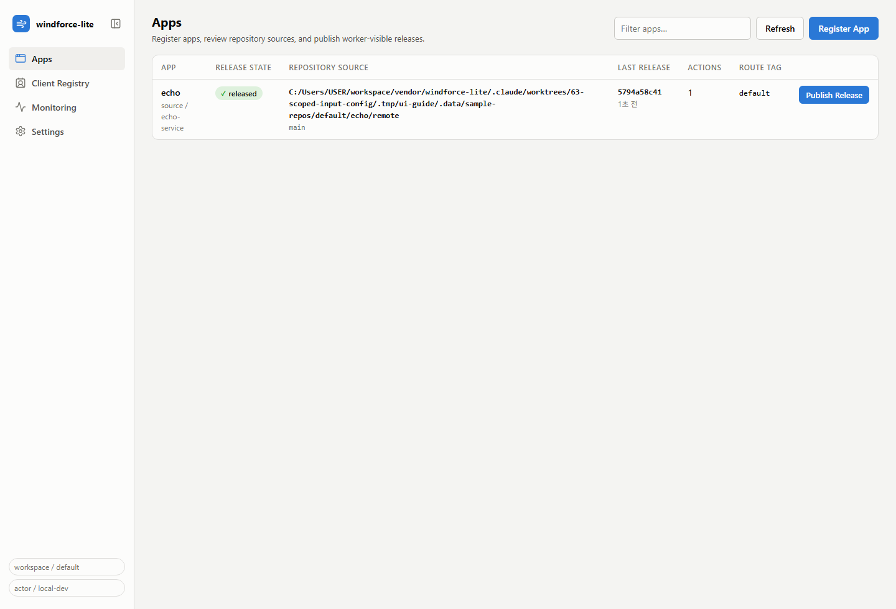

1. Open the Web UI; the Apps view lists every registered app.
2. Check the release state badge: released apps have a worker-visible contract, registered apps do not yet.
3. Compare repository source, last release commit, action count, and route tag per app.
4. Use Publish Release directly from a row, or Open App for the full detail view.

## Register an app

Register App points the control plane at a repository source. Registration validates repository access, branch, and windforce.json before saving.

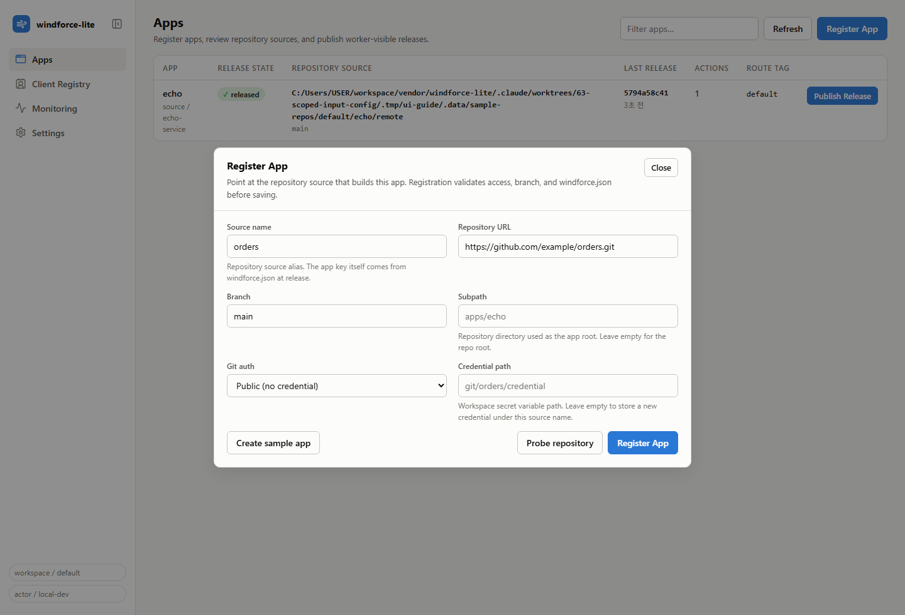

1. Click Register App in the Apps view.
2. Enter the app name, repository URL, branch, and optional subpath.
3. Pick a git auth method or reference an existing credential variable path.
4. Use Probe repository to confirm reachability and branch existence before registering.

## Inspect an app

The app detail Overview tab shows the active release and readiness signals for workers.

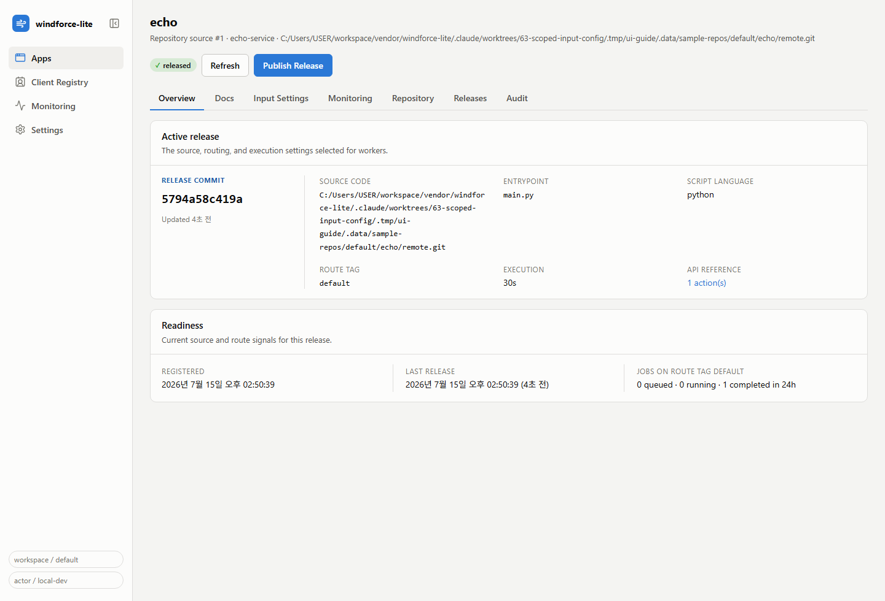

1. Open an app from the Apps view.
2. Review the active release: app key, release commit, entrypoint, and update time.
3. Follow the source code link to browse the repository at the pinned release commit on GitHub/GitLab.
4. Use the tabs for repository settings, release history, and action schemas.

## Publish a release

Publish Release validates the repository source at HEAD and publishes it as the worker-visible contract, recorded with the audit actor.

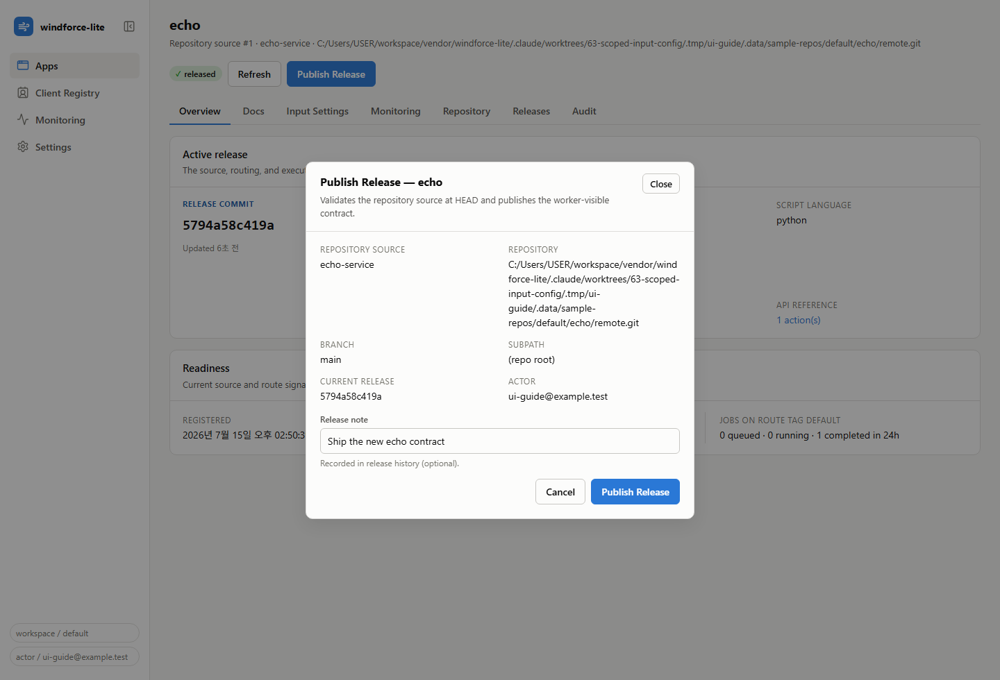

1. Open an app and click Publish Release.
2. Confirm the repository, branch, subpath, and current release commit.
3. Add a release note for the audit trail.
4. Publish; the release history records the actor, commit, and note.

## Review release history

The Releases tab is the publish history of the worker-visible contract: who published which commit, from which source, and why. Configuration changes live on the Audit tab.

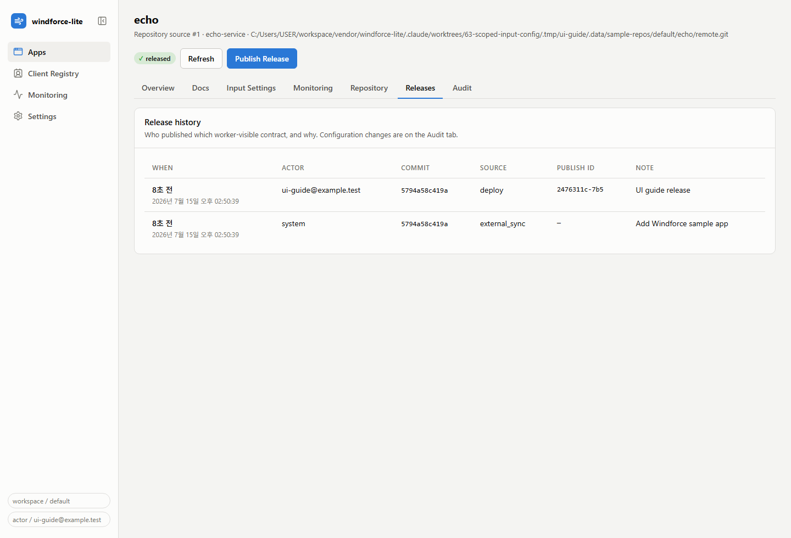

1. Open an app and switch to the Releases tab.
2. Each release record shows the actor, commit, source, release id, and note.
3. Use it to answer who published which contract, and when; configuration changes are on the Audit tab.

## Review action schemas

The Docs tab shows each action's release-pinned input and output JSON Schemas.

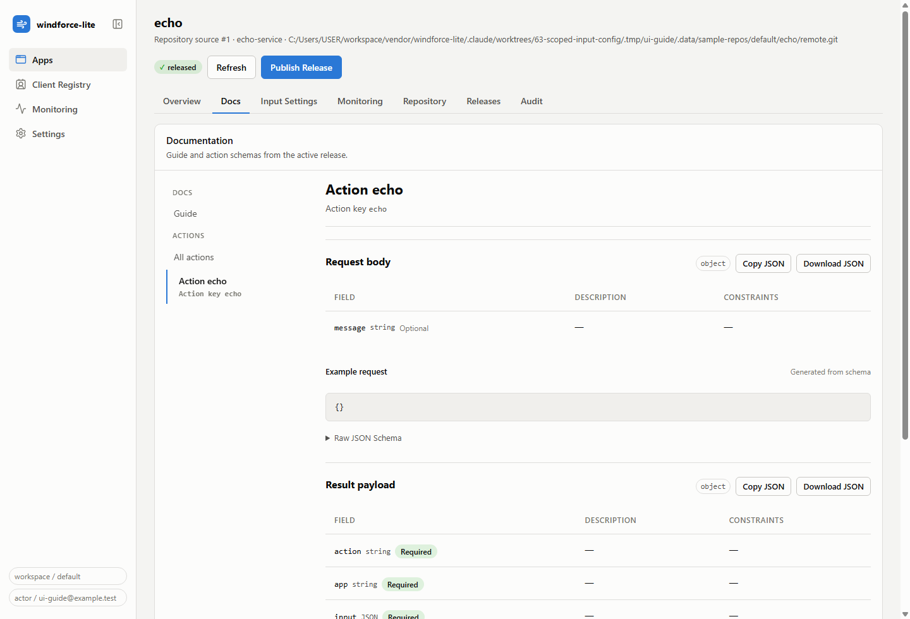

1. Open an app and switch to the Docs tab.
2. Choose an action from the API reference.
3. Review its request and result fields or download the source JSON Schema.

## Monitor one app

The app detail Monitoring tab narrows the workspace job aggregates to a single app: queued and running now, plus completed, failed, canceled, and the failure rate in the selected window.

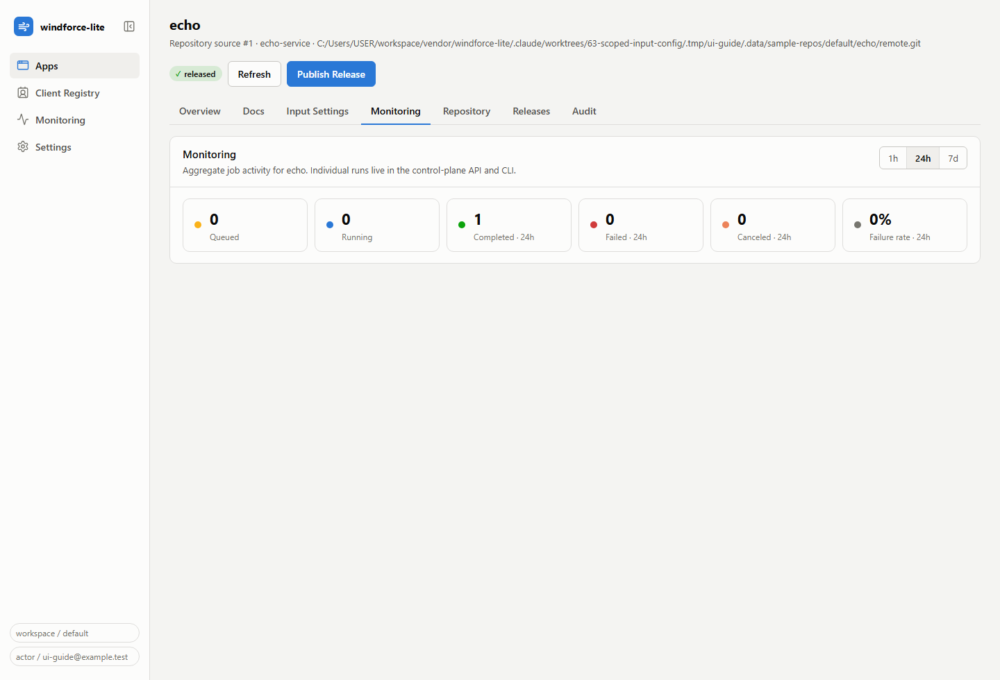

1. Open an app and switch to the Monitoring tab.
2. Read the tiles for this app's queued, running, and windowed completed/failed/canceled counts.
3. Switch the window between 1h, 24h, and 7d.
4. Watch the failure rate; the workspace-wide picture lives on the Monitoring page.

## Audit configuration changes

The Audit tab records who changed the app's configuration: repository settings edits, source deletion, and route tag overrides. Releases have their own history on the Releases tab.

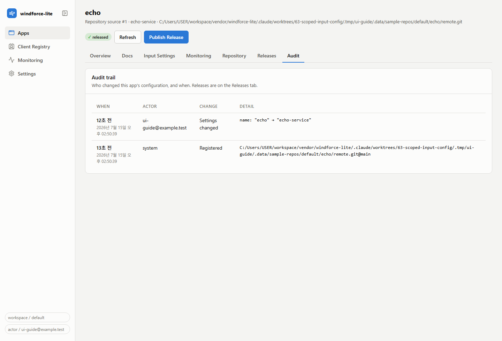

1. Open an app and switch to the Audit tab.
2. Each record shows the actor, the kind of change, and the changed fields.
3. Use it together with the Releases tab to answer who changed what, and when.

## Monitor job activity

The Monitoring view aggregates job activity for the whole workspace: totals, per-app and per-route-tag breakdowns, and failure rates. Individual runs are an API/CLI concern.

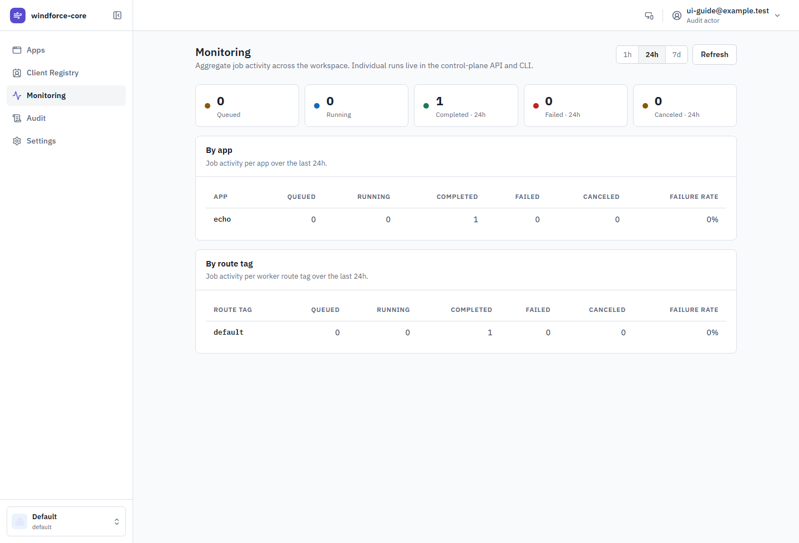

1. Open Monitoring from the sidebar.
2. Read the tiles: queued and running now, plus completed, failed, and canceled runs in the selected window.
3. Switch the window between 1h, 24h, and 7d.
4. Use the by-app and by-route-tag tables to find where the failure rate is moving; app names link to the app detail.

## Set the control-plane context

Settings holds the workspace, API token, and audit actor that every Web UI request uses. Values are stored in the browser.

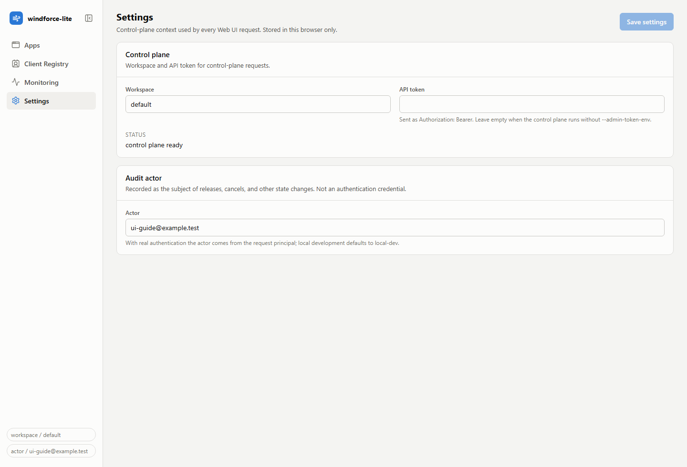

1. Open Settings from the sidebar.
2. Set the workspace and, when the control plane requires one, the API token.
3. Set the audit actor recorded on releases and cancels; local development defaults to local-dev.

## Collapse the sidebar

The sidebar collapses to an icon rail so wide tables get the full viewport. The choice is remembered in the browser.

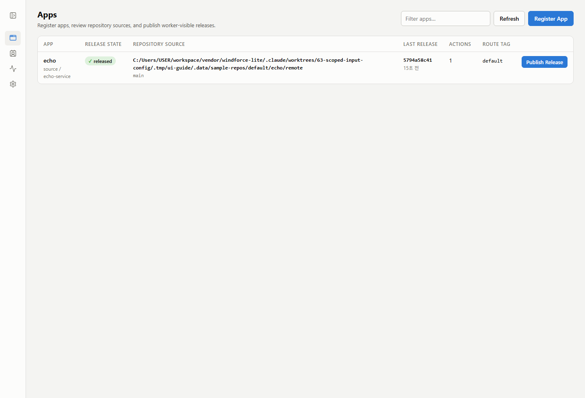

1. Click the collapse control beside the product title at the top of the sidebar.
2. Navigate with the icon rail; hover shows each destination.
3. Click the control again to expand the sidebar.

## Manage client input settings

Review app- and action-specific values applied for one external client.

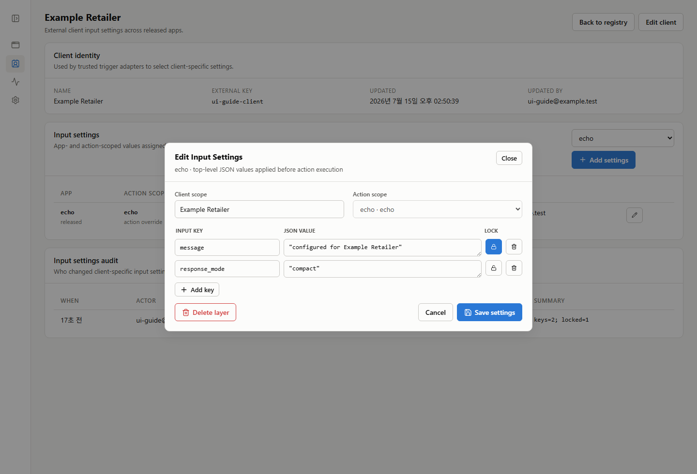

1. Open Client Registry.
2. Select an external client.
3. Open a settings row to review its JSON values and locked keys.
