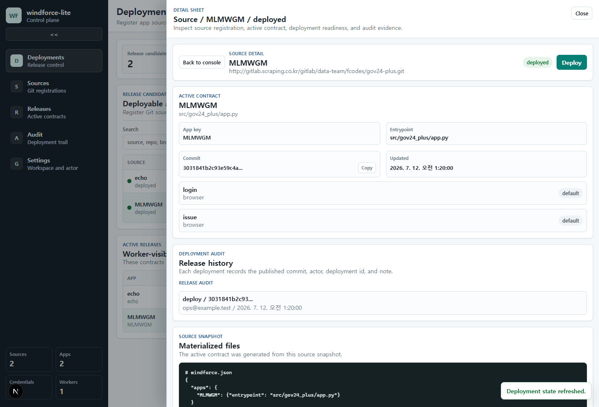

# windforce-lite Web UI User Guide

<!-- Generated by `node tools/ui-guide/capture.mjs`. Edit `docs/ui-scenarios/*.mjs` instead. -->

This guide is generated from executable UI scenarios. Screenshots are captured from the local windforce-lite devstack.

## Set control plane context

Use the Settings page to select the workspace, API token, and actor used by Web UI control-plane requests.

1. Open Settings from the command bar or sidebar.
2. Set the workspace and optional API token when the control plane requires one.
3. Set Actor before deploying a source so audit history has a subject.

## Collapse navigation

Collapse the sidebar while keeping deployment work visible.

1. Click the sidebar collapse control.
2. Use the compact navigation rail to keep deployment work visible.

## Manage deployments

Use the deployment console to inspect registered sources, active contracts, readiness, and deployment audit evidence.

1. Open the deployment management console.
2. Use the sidebar to move between deployment, source, release, and audit work areas.
3. Use the release candidate table to compare registered sources.
4. Open a source sheet for deployment evidence.
5. Use the active contracts table to confirm what workers can execute.

## Inspect a source detail sheet

Open a registered source sheet to review source registration, active contract, readiness, source snapshot, and audit evidence.

1. Open the deployment management console.
2. Open a registered source detail sheet.
3. Review the active worker contract and exposed actions.
4. Check readiness signals before deploying.
5. Inspect the active source snapshot and latest audit entries.

## Deploy a source

Use the Deployments view to publish the selected source as the active Windforce app contract.

1. Open the deployment management console.
2. Select a registered source.
3. Open the deploy dialog.
4. Confirm repository, branch, subpath, and current release.
5. Add a deployment note and deploy the source.

## Inspect active deployment contracts

Use the Releases view to inspect the deployed app contract, history, and source snapshot.

1. Open the deployment management console.
2. Select an active app contract.
3. Use Contract to review the worker-visible action list and route tag.
4. Use History to inspect deployment audit entries.
5. Use Source Snapshot to inspect the materialized files used by the release.
