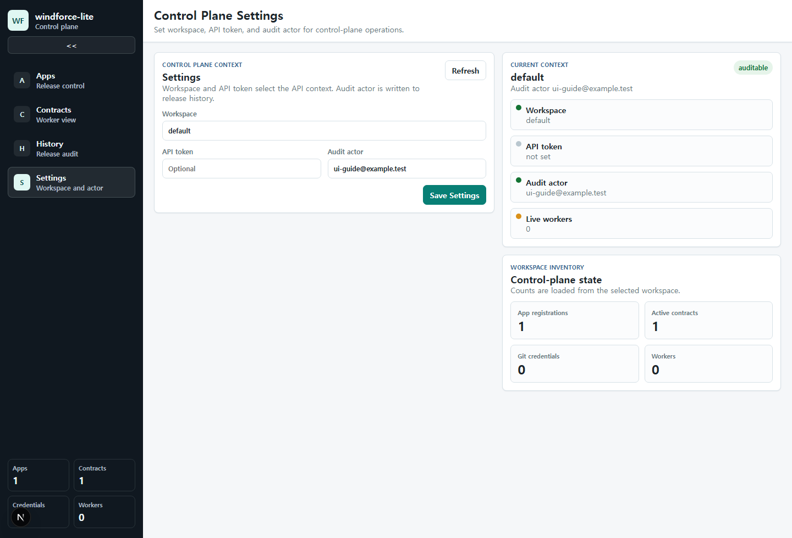
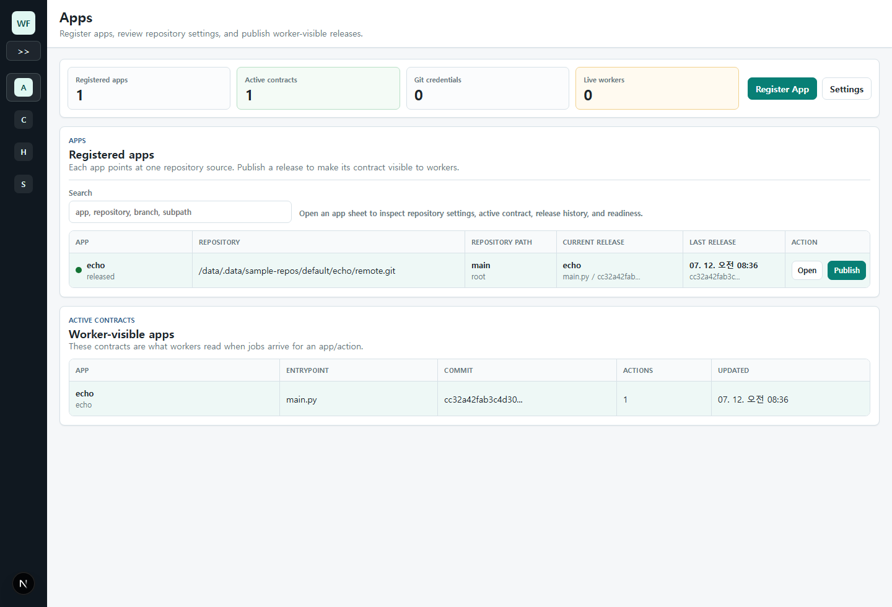
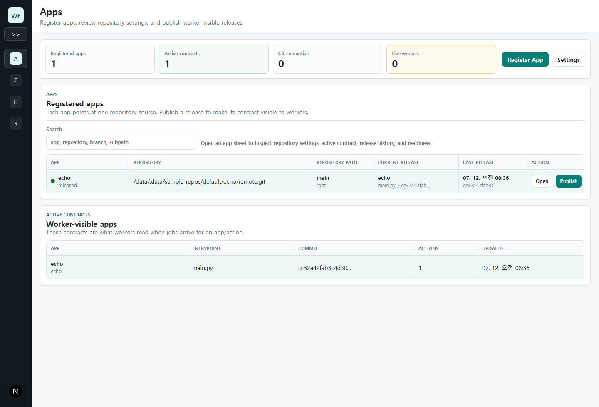
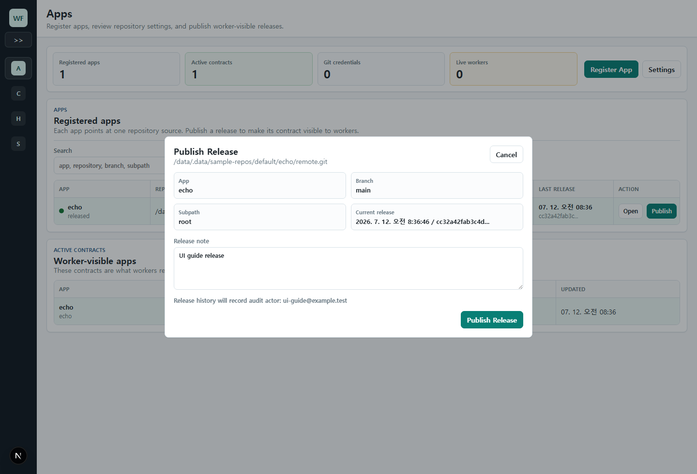
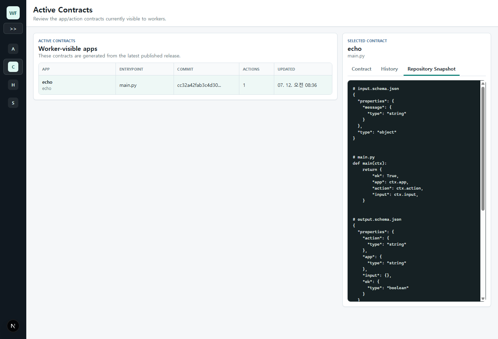

# windforce-lite Web UI User Guide

<!-- Generated by `node tools/ui-guide/capture.mjs`. Edit `docs/ui-scenarios/*.mjs` instead. -->

This guide is generated from executable UI scenarios. Screenshots are captured from the local windforce-lite devstack.

## Set control plane context

Use the Settings page to select the workspace, API token, and audit actor used by Web UI control-plane requests.

1. Open Settings from the command bar or sidebar.
2. Set the workspace and optional API token when the control plane requires one.
3. Set the audit actor that release history records for state-changing requests.

## Collapse navigation

Collapse the sidebar while keeping app release work visible.

1. Click the sidebar collapse control.
2. Use the compact navigation rail to keep app release work visible.

## Manage app releases

Use the app console to inspect registered apps, active contracts, readiness, and release audit evidence.

1. Open the app release console.
2. Use the sidebar to move between Apps, Contracts, History, and Settings.
3. Use the app table to compare registered apps.
4. Open an app sheet for release evidence.
5. Use the active contracts table to confirm what workers can execute.

## Inspect an app detail sheet

Open a registered app sheet to review repository settings, active contract, readiness, repository snapshot, and audit evidence.

1. Open the app release console.
2. Open a registered app detail sheet.
3. Review the active worker contract and exposed actions.
4. Check readiness signals before publishing a release.
5. Inspect the repository snapshot and latest audit entries.

## Publish app release

Use the Apps view to publish the selected app as the active worker contract.

1. Open the app release console.
2. Select a registered app.
3. Open the release dialog.
4. Confirm repository, branch, subpath, and current release.
5. Add a release note and publish the app.

## Inspect active contracts

Use the Active Contracts view to inspect the worker-visible app contract, release history, and repository snapshot.

1. Open the app release console.
2. Select an active app contract.
3. Use Contract to review the worker-visible action list and route tag.
4. Use History to inspect release audit entries.
5. Use Repository Snapshot to inspect the materialized files used by the release.
