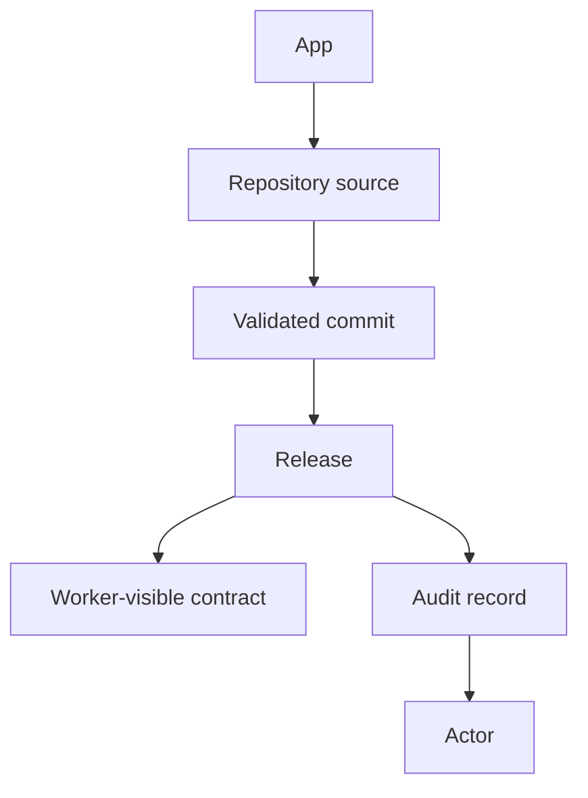

# windforce-lite Web UI 정보 모델

이 문서는 windforce-lite Web UI가 사용자에게 노출하는 개념과 화면 책임을 정의한다. UI 구현과 문구는 이 모델을 기준으로 맞춘다.

## 핵심 개념

| 개념 | 의미 | UI에서의 위치 |
|---|---|---|
| App | 운영자가 배포하고 worker가 실행하는 논리 단위 | 기본 목록, 상세 화면, release 실행의 주 대상 |
| Repository source | App 코드를 가져올 Git repository, branch, subpath, credential 설정 | App 상세의 repository settings |
| Release | 특정 repository source commit을 검증하고 worker-visible contract로 게시한 결과 | App 상세의 release history와 active contract |
| Actor | release, repository 설정 변경, 삭제 같은 상태 변경을 수행한 주체 | audit record의 subject |
| Contract | worker가 job 실행 시 읽는 app/action 실행 계약 | Active contract 패널 |

## 관계

## 화면 책임

### Apps

운영자가 가장 먼저 보는 화면이다. 각 행은 하나의 App으로 읽혀야 한다. repository source가 아직 release되지 않은 경우에도 App 후보로 표시한다.

Apps 화면은 다음 질문에 답한다.

- 어떤 App이 등록되어 있는가?
- 현재 worker가 실행하는 contract가 있는가?
- 어떤 repository, branch, subpath에서 release되는가?
- 마지막 release commit과 시각은 무엇인가?
- 지금 release할 수 있는가?

### Repository Settings

Repository source를 등록하거나 수정하기 위한 설정 화면이다. 이 화면은 App 자체를 설명하지 않는다. Git 접근, credential, branch, subpath, manifest validation 상태를 다룬다.

### Active Contracts

현재 worker가 읽을 수 있는 contract를 확인하는 화면이다. App/action, entrypoint, route tag, capability, commit을 확인한다.

### Release History

상태 변경 이력을 확인하는 화면이다. 각 record는 actor, commit, release id, note, 시각을 포함한다.

### Settings

workspace, API token, actor를 설정한다. actor는 인증 수단이 아니라 audit subject다. 실제 인증이 연결된 환경에서는 요청의 인증 주체에서 actor가 정해진다.
로컬 개발처럼 인증 주체가 없는 Web UI는 `local-dev`를 기본 actor로 사용한다.

## 문구 규칙

- 버튼은 App 관점으로 쓴다: `Register App`, `Publish Release`, `Open App`.
- `Source`는 단독 메뉴나 주 대상 이름으로 쓰지 않고 `repository source` 또는 `source settings`처럼 범위를 붙인다.
- `Deployment`는 사용자 작업 이름으로 남발하지 않는다. 상태 변경 record나 audit 맥락에서는 `release` 또는 `deployment record`로 쓴다.
- `FCode`는 windforce-lite UI 용어로 쓰지 않는다.
- `Actor`는 audit subject로 설명한다. Git credential이나 API token과 섞어 설명하지 않는다.
