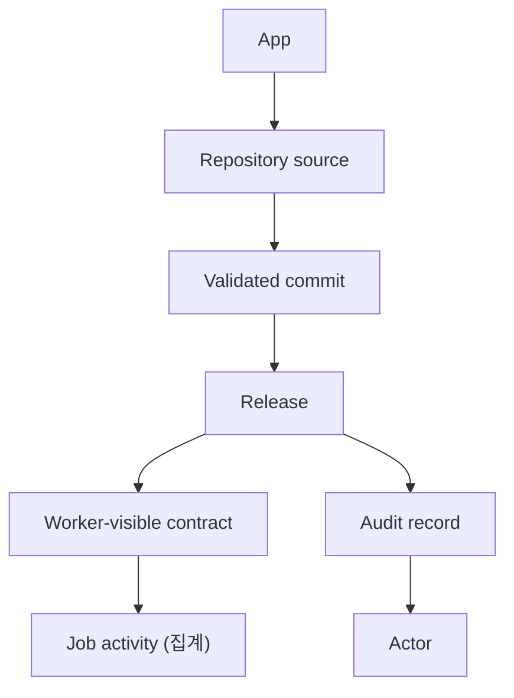

# windforce-lite Web UI 정보 모델과 화면 기획

이 문서는 windforce-lite Web UI가 노출하는 개념, 화면 구조, 라우트, 문구 규칙을
정의한다. UI 구현과 문구는 이 문서를 기준으로 맞춘다. 기술 스택과 빌드 파이프라인
결정은 [ADR 0004](adr/0004-web-ui-rewrite.md)에 있다.

## 목표

Web UI는 운영자가 다음 질문에 브라우저에서 답할 수 있게 한다.

1. 어떤 App이 등록되어 있고, worker가 지금 실행할 수 있는 contract는 무엇인가?
2. 누가 언제 어떤 commit을 release했는가?
3. workload가 지금 어떤 모양인가 — 어느 App/route tag에서 얼마나 쌓이고,
   돌고, 실패하고 있는가?

수백만 건 규모에서 개별 job 레코드를 열람하는 것은 운영 질문에 답하지
못한다. UI는 집계만 보여주고, 개별 run의 payload/로그/취소는 control-plane
API와 CLI의 몫이다 ([ADR 0005](adr/0005-aggregate-job-observability.md)).

전체 Windforce 콘솔 재구현이 아니다. SaaS 테넌트 관리, billing, quota,
scheduler UI, workflow designer는 범위 밖이다 ([ADR 0003](adr/0003-lightweight-admin-ui.md)).

## 핵심 개념

| 개념 | 의미 | UI에서의 위치 |
|---|---|---|
| App | 운영자가 배포하고 worker가 실행하는 논리 단위 | Apps 목록, App 상세, release의 주 대상 |
| Repository source | App 코드를 가져올 Git repository, branch, subpath, credential 설정 | App 상세의 Repository 탭 |
| Release | 특정 repository source commit을 검증하고 worker-visible contract로 게시한 결과 | App 상세의 Releases 탭과 active contract |
| Contract | worker가 job 실행 시 읽는 app/action 실행 계약 | App 상세의 Overview 탭 |
| Job activity | App/route tag 단위로 집계된 run 통계 (queued, running, 최근 완료/실패/취소) | Monitoring 대시보드, App 상세 readiness |
| Actor | release, 설정 변경 같은 상태 변경을 수행한 주체 (audit subject) | release history와 audit trail |

## 관계

## 화면 구조와 라우트

SPA이며 모든 라우트는 `/ui/` 아래에 있다. 좌측 내비게이션은 Apps, Monitoring,
Settings 세 항목만 노출하고, 아이콘 레일로 접을 수 있다(브라우저에 저장).

| 라우트 | 화면 |
|---|---|
| `/ui/` | Apps 목록 |
| `/ui/apps/{sourceId}` | App 상세 (Overview 탭) |
| `/ui/apps/{sourceId}/{tab}` | App 상세 탭: `overview`, `monitoring`, `repository`, `releases`, `audit`, `actions` |
| `/ui/monitoring` | Monitoring 집계 대시보드 (`/ui/jobs`는 구 경로 호환) |
| `/ui/settings` | 컨트롤 플레인 설정 |

App 상세는 repository source id를 URL 키로 쓴다. 아직 release되지 않은
등록-only source도 같은 상세 화면을 갖기 때문이다.

### Apps (목록)

운영자가 가장 먼저 보는 화면. 각 행은 하나의 App으로 읽혀야 하고, release되지
않은 repository source도 App 후보로 표시한다. `git_sources` 목록과
`apps?view=summary`를 `git_source_id`로 합쳐 그린다.

행이 답하는 질문: 이름, release 상태(released/registered), repository와
branch/subpath, 마지막 release commit과 시각, action 수, route tag.

주요 동작: `Register App` (등록 다이얼로그), `Publish Release` (확인
다이얼로그), `Open App` (상세로 이동), 샘플 App 생성.

등록 다이얼로그는 repo URL, branch, subpath, 인증 방식(none/token/basic)과
credential을 받고, 등록 전에 `probe`로 도달성과 branch 존재를 확인할 수 있다.

### App 상세

한 App의 모든 것을 탭으로 다룬다.

- **Overview**: active contract (entrypoint, script lang, route tag, commit,
  timeout, capabilities)와 action 목록, readiness 신호. 코드는 UI가
  미러링하지 않는다: release commit에 고정된 GitHub/GitLab 링크로 연결한다
  ([ADR 0006](adr/0006-source-links-not-source-mirror.md)). release되지
  않았으면 그 사실과 다음 단계를 안내한다.
- **Monitoring**: 이 App으로 좁힌 job 집계 (`jobs/summary`의 by_app) —
  queued/running과 시간 창별 완료/실패/취소, 실패율.
- **Repository**: repository source 설정을 보고 수정한다 (name, repo URL,
  branch, subpath, creds ref). 수정은 `PATCH git_sources/{id}`로 반영되고
  서버가 재검증한다. `probe`로 도달성 확인.
- **Releases**: release history. 각 record는 actor, commit, release id
  (deployment id), note, source, 시각을 보여준다. 상단에 `Publish Release`
  버튼을 둔다.
- **Audit**: 설정 변경이력 (`git_sources/{id}/audit`) — repository 설정
  수정, source 삭제, route tag override가 actor와 함께 기록된다. release
  게시는 Releases 탭이 담당하고 audit에는 중복 기록하지 않는다.
- **Actions**: action별 input/output JSON Schema (`actions/{action}/schema`).
  action 호출은 API/CLI의 몫이고 UI는 계약(스키마)만 보여준다.

위험 작업(App 삭제)은 Repository 탭 하단의 danger zone에 둔다.

### Monitoring

workload 집계 대시보드. 개별 job 레코드는 다루지 않는다.

- 상단: `jobs/summary` 기반 요약 타일 — queued, running(현재), 선택한
  시간 창의 completed/failed/canceled.
- 시간 창 선택: 1h / 24h / 7d (`recent_seconds`).
- App별 집계 테이블: queued, running, 시간 창 내 completed/failed/canceled,
  실패율. App 이름은 App 상세로 연결된다.
- Route tag별 집계 테이블: 같은 지표를 tag 단위로.

개별 run의 payload, 로그, cancel은 control-plane API와 CLI
(`tools/windforce_control.py`)로 처리한다.

### Settings

workspace, API token, actor를 설정한다. 브라우저 localStorage에 저장한다.
actor는 인증 수단이 아니라 audit subject다. 실제 인증이 연결된 환경에서는
요청의 인증 주체에서 actor가 정해진다. 로컬 개발처럼 인증 주체가 없는 Web
UI는 `local-dev`를 기본 actor로 사용한다.

## 문구 규칙

- 버튼은 App 관점으로 쓴다: `Register App`, `Publish Release`, `Open App`.
- `Repository`는 최상위 메뉴로 쓰지 않는다. App 상세 안의 Repository 탭과
  repository source 맥락에서만 쓴다.
- `Source`는 단독 메뉴나 주 대상 이름으로 쓰지 않고 `repository source` 또는
  `source code`처럼 범위를 붙인다. 코드 자체는 UI가 보여주지 않고 forge
  링크로 연결한다.
- `Deployment`는 사용자 작업 이름으로 남발하지 않는다. 상태 변경 record나
  audit 맥락에서는 `release` 또는 `release record`로 쓴다.
- 집계 화면(메뉴)은 `Monitoring`으로 부른다. API 대상과 데이터 항목은
  `Job`으로 부르고, 문장 안에서 실행 사건을 가리킬 때는 run을 쓴다. UI 문구는 개별 record가 아니라 집계를 가리키게
  쓴다: `job activity`, `failure rate`.
- `FCode`는 windforce-lite UI 용어로 쓰지 않는다.
- `Actor`는 audit subject로 설명한다. Git credential이나 API token과 섞어
  설명하지 않는다.
